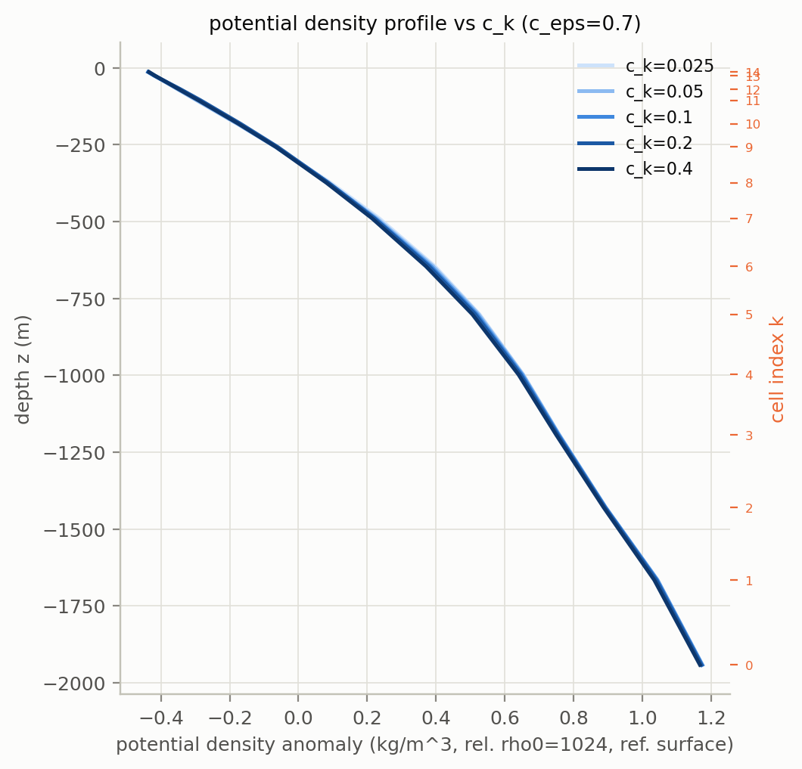
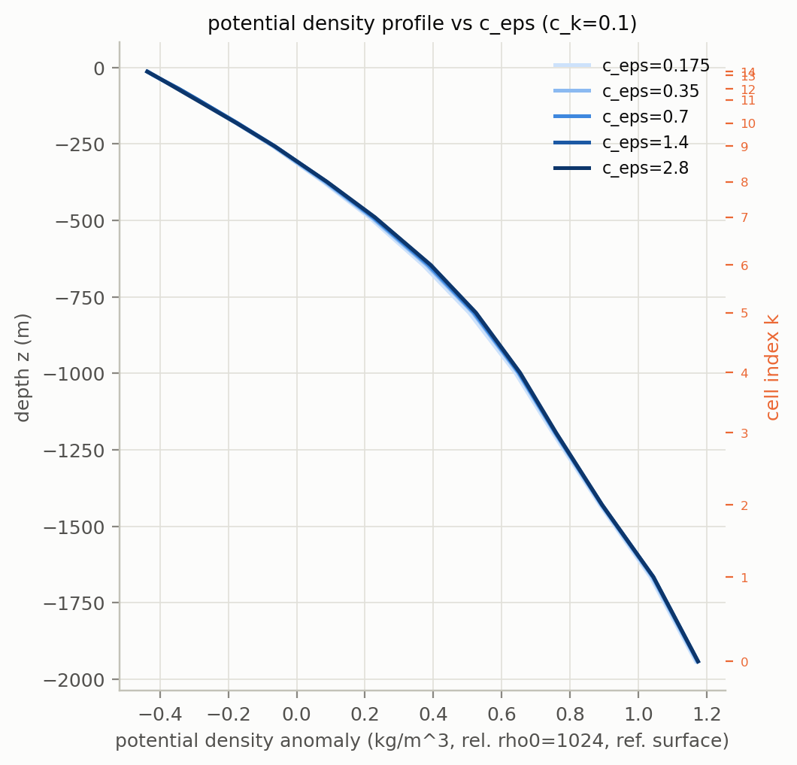
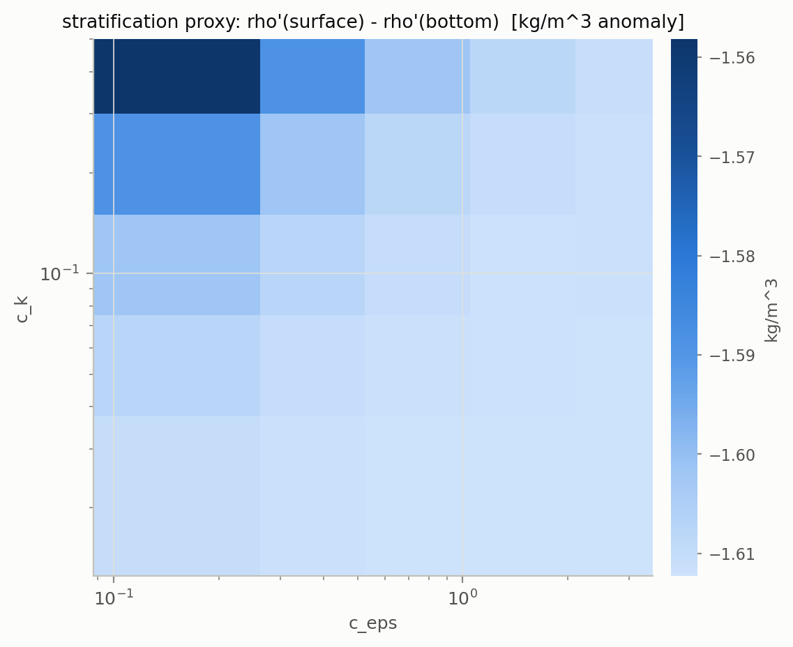

# Does the TKE closure (c_k, c_eps) shape the ACC's density profile?

<!-- AUTO:summary -->
Run: OAR job `3100462`, grenoble (NVIDIA L4 GPU), `20260914T201314Z`..`20260914T211254Z`
(57.3 min for all 25 runs). 30 model-years per point, 5x5 grid of (c_k, c_eps),
25/25 runs completed without diverging.

**Short answer: c_k and c_eps have a real but small effect on the ACC's
potential density profile -- a few percent of the column's stratification,
not a qualitative change in shape.** The surface-minus-bottom density-anomaly
contrast (the stratification proxy below) ranges from -1.558 to -1.612 kg/m^3
across the grid, a spread of 0.054 kg/m^3 -- 3.4% of the mean. The effect is
driven almost entirely by the high-c_k/low-c_eps corner (more TKE production,
less dissipation -> more turbulent kinetic energy -> more vertical mixing ->
weaker stratification), physically the expected direction; the rest of the
grid is nearly flat. Holding the other parameter at its default, sweeping
c_k alone or c_eps alone each move the proxy by about 0.010 kg/m^3 (~0.6%) --
both parameters matter about equally in isolation, and their effects compound
in the corner where they point the same way.
<!-- /AUTO:summary -->

## Setup

`mini_veros.setups.acc.full` (idealized channel, TKE + EKE closures on,
`dt_tracer` = 43200s), the TKE closure's production/dissipation constants
`c_k`, `c_eps` (defaults 0.10 / 0.70) swept on a 5x5 log2-spaced grid spanning
a factor of 16 around each default:

- `c_k`  in {0.025, 0.05, 0.10, 0.20, 0.40}
- `c_eps` in {0.175, 0.35, 0.70, 1.40, 2.80}

Each of the 25 runs starts cold and is integrated 30 model-years forward
(`common.N_YEARS`) -- long enough to settle: `acc_full` in the mini-veros/veros
comparison (`report/matrix_report.md`) already reaches climatology ratio
~0.00 for temperature/streamfunction by 15 model-years, so 30 has margin. The
reported profile per point is the horizontally-averaged (area-weighted, ocean
cells only) potential density anomaly (`eq_of_state_type=3`, referenced to the
surface, relative to `rho0=1024 kg/m^3`), averaged over the last ~model-year
(last 12 of 365 logged 30-day snapshots).

## Results

<!-- AUTO:figures -->
### Profile vs c_k (c_eps held at default)

### Profile vs c_eps (c_k held at default)

### Stratification proxy across the full grid

### All 25 profiles minus the grid-mean profile

### Mixed-layer depth, the 5 points rerun with full state saved
The 5 points with the largest deviation from the grid-mean profile
(`common.TOP5`) were rerun saving the full `PrognosticState` every 30 days
(`run_top5_full_state.py`); mixed-layer depth (MLD, density criterion
Delta-sigma=0.03 kg/m^3, de Boyer Montegut et al. 2004) is computed per
snapshot and averaged over the final model-year. Each panel shows that run's
MLD minus the 5-run mean MLD at each cell (a diverging colormap, scaled to
the largest anomaly present) -- the shared channel MLD pattern is large
compared to the (c_k, c_eps) effect, so subtracting it out is what makes the
effect visible at all.

### Zonal-mean MLD vs latitude, through the 30-year run
Same 5 runs; each panel shows the zonal-mean MLD-vs-latitude profile at 15
snapshots spread across the full run, light (year ~1) to dark (year 30).

### Basin-averaged prognostic fields, through the 30-year run
Same 5 runs, one panel per prognostic field (u, v, temp, salt, tke, eke,
psi), each showing that field's basin average (volume-weighted for the 3D
fields, area-weighted for psi, ocean cells only) through the full run, all 5
runs overlaid, each with its own colour shading a local rolling-std band
around its own line (how much that run's series wiggles near each point in
time).

### Channel kinetic energy, basin-mean MLD, and density convergence
Same 5 runs, 3 more diagnostics: (1) mean(u^2+v^2) restricted to the periodic
part of the channel (y<-20, south of the "Atlantic block" landmass, so no
island/zonal-boundary effects -- the ACC proper), volume-weighted; (2)
basin-mean MLD (area-weighted, ocean surface cells) through the full run;
(3) the step-to-step density change RMS(rho[t+1]-rho[t]) (volume-weighted,
log scale) -- a direct check that the density field is actually converging,
not just that a derived statistic looks flat. Each line also shades its own
local rolling-std band, in that run's own colour.

<!-- /AUTO:figures -->

## Reading

<!-- AUTO:reading -->
- **The profile lines vs c_k and vs c_eps (each with the other parameter held
  at its default) are visually indistinguishable** -- the 5 curves in each
  figure overlap to within line width. This is real: at fixed c_eps=0.70, the
  stratification proxy only moves from -1.612 (c_k=0.025) to -1.602
  (c_k=0.4); at fixed c_k=0.10, from -1.602 (c_eps=0.175) to -1.612
  (c_eps=2.8). Reading either 1D slice alone would suggest c_k/c_eps barely
  matter.
- **The heatmap tells a different story: the two parameters interact.** The
  full 5x5 grid's range (0.054 kg/m^3) is 5x either 1D slice's range (0.010
  kg/m^3) -- the effect only becomes clearly visible when c_k is pushed high
  *and* c_eps is pushed low simultaneously (top-left corner of the heatmap,
  c_k=0.4, c_eps=0.175: -1.558, vs the grid mean -1.606). Both knobs move the
  turbulent kinetic energy budget the same way (more production, less
  dissipation), so their effects compound rather than cancel or average out.
- **The effect concentrates at the pycnocline, not the whole column.** The
  per-depth-level range across the grid peaks at z=-490 to -646m (0.06-0.068
  kg/m^3) and falls off both toward the surface (down to 0.012 kg/m^3 near
  z=-14m) and the abyss (0.015 kg/m^3 near z=-1942m) -- consistent with
  mixing strength acting on the sharpness of the existing pycnocline rather
  than uniformly redistributing density top-to-bottom.
- **All 25 runs stayed stable over 30 model-years**, including the most
  TKE-heavy corner (c_k=0.4, c_eps=0.175) -- no divergence to report, unlike
  e.g. `acc_minimal` in the matrix comparison. The instability risk flagged in
  `test/ck_ceps_sweep/README.md` (production outrunning dissipation) did not
  materialize inside this grid's range.
- **Subtracting the grid-mean profile makes the interaction visible at a
  glance.** 24 of 25 combinations collapse to a thin bundle within +-0.015
  kg/m^3 of the mean at every depth; only c_k=0.4/c_eps=0.175 (the corner
  identified above) peels off, swinging to -0.05 kg/m^3 around z=-650m before
  rejoining the bundle near the surface and the abyss. c_k=0.2/c_eps=0.175
  (the next darkest solid line) shows the same shape at about half the
  amplitude -- one combination is a clean outlier, not several, and the
  effect is a smooth function of how far into that corner a run sits rather
  than a threshold/bifurcation.
- **The MLD maps confirm the mechanism directly, not just via the density
  proxy.** MLD is deep at the channel's high-latitude edges (where surface
  restoring cools the water and wind stress is strongest) and shallow in the
  tropical band, for every run -- the spatial pattern itself doesn't depend on
  (c_k, c_eps). What moves is the magnitude: mean MLD across the channel is
  341m/315m/322m for the three high-c_k/low-c_eps runs vs 259m/262m for the
  two low-c_k/high-c_eps runs -- roughly 20-30% deeper mixing in the
  high-TKE group, consistent with the weaker stratification found above. At
  the deepest edge columns the three high-c_k runs mix all the way to the
  bottom cell (1942m, i.e. the 0.03 kg/m^3 threshold is never crossed in that
  column); the two low-c_k runs stop one cell short (1666m) -- a small but
  real difference in how close to fully-mixed the edge columns get.
- **The anomaly-from-mean view makes the split between the two regimes
  immediate.** The three high-c_k/low-c_eps runs are uniformly red (deeper
  than the 5-run mean) at the northern edge (y~30-40) and the southern edge
  (y~-35 to -40); the two low-c_k/high-c_eps runs are uniformly blue
  (shallower than the mean) at the same latitudes. The sign flips cleanly
  between the two groups almost everywhere at the edges -- there's no run
  that's deep in one edge and shallow in the other. The interior (y~-20 to
  20) stays near-zero anomaly for every run, matching the earlier
  reading that the effect concentrates where mixing is already strong,
  not everywhere.
- **The 30-year run length is justified by what's on screen, not just by the
  matrix-report proxy cited in Setup.** Early snapshots (light blue) are
  jagged and far from the late ones, particularly at the two edges (y~-40 and
  y~35-40) where the (c_k, c_eps) effect lives; by year ~15-20 the curves
  stack tightly and by year 30 (darkest) the profile has visibly stopped
  moving in all 5 runs -- the same conclusion the matrix-report climatology
  ratio gave for `acc_full`, now visible directly for these specific TKE
  settings rather than inferred from a different run.
- **The basin-mean fields nuance the "settled by year 30" claim above: the
  upper ocean has settled, the deep basin hasn't.** u, v, eke and psi plateau
  clearly within ~10-15 years, matching the MLD-evolution figure. Basin-mean
  temp and salt do not: temp is still falling roughly linearly at year 30
  (~5.7-5.4 degC across the 5 runs, no sign of levelling off) and salt is
  still rising after an initial dip. This is the ordinary two-timescale
  behaviour of ocean spin-up -- the mixed layer and pycnocline (what the
  density-profile and MLD figures above measure) adjust in years, the
  full-depth heat/salt content in centuries -- but it does mean this report's
  "30 years is enough" claim is scoped to the upper-ocean stratification
  question it was checking, not to the basin's total heat content, which is
  still drifting.
- **Basin-mean tke goes negative and keeps falling, with no visible spread
  between the 5 runs.** This is unexpected for a quantity that should be
  non-negative, and unlike every other field its 5 curves are indistinguishable
  at this scale. Flagging it rather than explaining it: it could be a genuine
  feature of this closure's numerics (e.g. a floor applied only where tke is
  used for diffusivities, not enforced in the stored state) or worth a closer
  look before this basin-mean diagnostic is relied on for tke specifically.
- **Channel kinetic energy explains the eke split found earlier: more TKE
  production drains the mean flow, it doesn't feed it.** The 3 high-c_k runs
  have visibly *lower* mean(u^2+v^2) in the periodic channel at long time
  (~0.0023-0.0025 m^2/s^2) than the 2 low-c_k runs (~0.0028-0.0029), despite
  starting identically and peaking together around year 3-6. c_k=0.4 (bluest
  curve) is both lowest at long time and the only one still visibly declining
  at year 30 -- consistent with stronger vertical mixing extracting more
  kinetic energy through dissipation rather than adding to it.
- **Basin-mean MLD reproduces the split from the anomaly-map figure as a
  single number, and shows it is not yet static:** the two groups (high-c_k
  ~300-370m vs low-c_k ~235-295m) separate within ~2 years and stay cleanly
  separated for the rest of the run, but both groups are still slowly
  shrinking at year 30 (small step-like drops, likely tied to the slow
  basin-mean cooling noted above) -- the *gap* between the two regimes looks
  stable well before either individual curve does.
- **The density field is genuinely converging, not just visually flat: its
  own step-to-step change falls about two orders of magnitude** (from
  ~2x10^-2 kg/m^3 at year 1 to a few x10^-4 by year 30), with a clean early
  power-law-like decay through the first ~10 years. It does not reach exact
  zero: small spikes recur throughout the back half of the run (up to
  ~10^-3, transient and asynchronous across the 5 runs) -- read as episodic
  eddy activity riding on top of an otherwise converged mean state, not
  as the run failing to settle.
- **Caveat:** the stratification proxy is a single scalar (surface-minus-bottom
  anomaly); the full per-level ranges above show the interaction is
  depth-structured, so a reader who cares about a specific depth (e.g. the
  mixed-layer base) should read the per-level numbers rather than the single
  heatmap value.
<!-- /AUTO:reading -->
