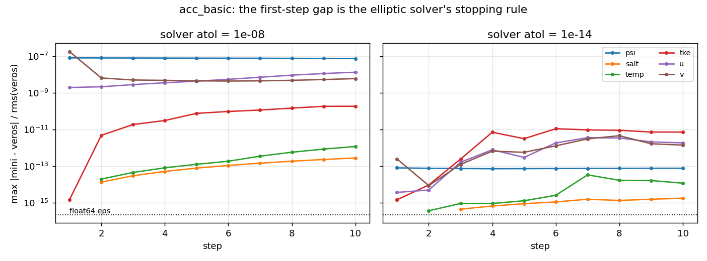
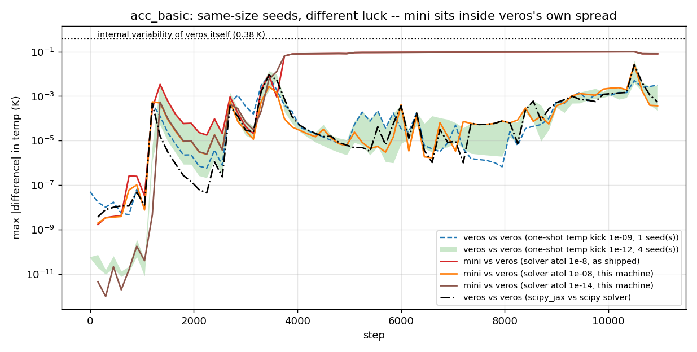
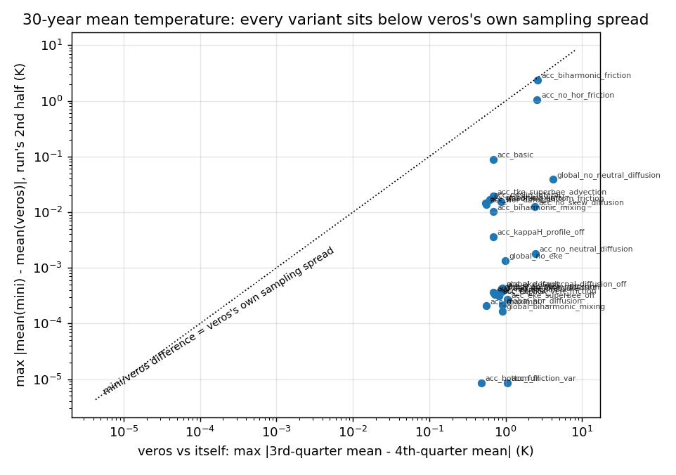

# Why mini_veros and veros trajectories separate

Generated by `test/plot_divergence_report.py` from `test/investigate_divergence.py`'s output. Companion to `matrix_report.md`.

## 1. The seed: the elliptic solver's stopping rule

Both codes call `bicgstab(..., tol=0, atol=1e-8)` for the external mode -- an *absolute* residual bound, so the two solvers are free to stop at points that differ by far more than `float64` roundoff. Tighten it and the first-step gap collapses by six orders of magnitude, which is what identifies it as the seed.

## 2. The amplifier: the flow itself

The controls are all veros against veros: four members kicked once at t=0 by a relative 1e-12 in temperature (shaded band), one kicked by 1e-9, and one run with nothing changed but the linear-solver backend (`scipy_jax` vs `scipy`, both veros's own supported options). That last one injects a per-step difference of the same size mini_veros does -- about 2e-8 relative in psi and 4e-10 in temperature by step 150, against mini_veros's 3e-8 and 2e-10.

## 3. Climatology

Here we compare the average over the 2nd half of the two runs (veros vs mini-veros) with the gap between the average on the third quarter and the last quarter of veros alone. (K) : Kelvin

| variant | records | rms mean diff (K) | max mean diff (K) | veros self, max (K) | ratio |
|---|---|---|---|---|---|
| acc_biharmonic_friction | 74 | 1.11e-01 | 2.38e+00 | 2.59e+00 | 0.92 |
| acc_no_hor_friction | 74 | 7.74e-02 | 1.06e+00 | 2.59e+00 | 0.41 |
| acc_basic | 74 | 1.27e-03 | 8.82e-02 | 6.84e-01 | 0.13 |
| acc_tke_superbee_advection | 74 | 6.56e-04 | 1.92e-02 | 6.84e-01 | 0.03 |
| acc_noslip_lateral | 74 | 2.60e-04 | 1.71e-02 | 6.24e-01 | 0.03 |
| acc_quadratic_bottom_friction | 74 | 2.21e-04 | 1.46e-02 | 5.48e-01 | 0.03 |
| acc_hor_diffusion | 74 | 4.44e-04 | 1.38e-02 | 5.60e-01 | 0.02 |
| global_maximal | 74 | 1.64e-04 | 1.53e-02 | 8.73e-01 | 0.02 |
| acc_biharmonic_mixing | 74 | 1.17e-04 | 1.02e-02 | 6.84e-01 | 0.01 |
| global_no_neutral_diffusion | 74 | 7.45e-04 | 3.87e-02 | 4.14e+00 | 0.01 |
| acc_kappaH_profile_off | 74 | 6.59e-05 | 3.66e-03 | 6.86e-01 | 0.01 |
| acc_no_skew_diffusion | 74 | 2.98e-04 | 1.24e-02 | 2.42e+00 | 0.01 |
| global_no_eke | 74 | 1.28e-05 | 1.36e-03 | 9.95e-01 | 0.00 |
| acc_no_neutral_diffusion | 74 | 1.72e-04 | 1.80e-03 | 2.45e+00 | 0.00 |
| acc_surface_pressure | 74 | 5.51e-06 | 3.60e-04 | 6.86e-01 | 0.00 |
| global_default | 74 | 2.99e-06 | 4.27e-04 | 9.03e-01 | 0.00 |
| acc_eke_isopycnal_diffusion_off | 74 | 4.86e-06 | 4.24e-04 | 8.97e-01 | 0.00 |
| acc_ray_friction | 74 | 3.24e-06 | 3.37e-04 | 7.24e-01 | 0.00 |
| global_no_skew_diffusion | 74 | 4.07e-06 | 3.83e-04 | 8.51e-01 | 0.00 |
| global_surface_pressure | 74 | 2.09e-06 | 3.78e-04 | 8.91e-01 | 0.00 |
| acc_explicit_vert_friction | 74 | 6.74e-06 | 3.15e-04 | 8.08e-01 | 0.00 |
| acc_no_tke | 74 | 6.74e-06 | 3.15e-04 | 8.08e-01 | 0.00 |
| acc_maximal | 74 | 4.42e-06 | 2.06e-04 | 5.62e-01 | 0.00 |
| acc_eke_superbee_off | 74 | 3.98e-06 | 2.69e-04 | 1.05e+00 | 0.00 |
| global_hor_diffusion | 74 | 1.47e-06 | 2.14e-04 | 9.04e-01 | 0.00 |
| global_biharmonic_mixing | 74 | 1.58e-06 | 1.65e-04 | 9.03e-01 | 0.00 |
| acc_bottom_friction_var | 74 | 2.83e-07 | 8.58e-06 | 4.79e-01 | 0.00 |
| acc_full | 74 | 1.02e-06 | 8.67e-06 | 1.05e+00 | 0.00 |

## 4. Step-0 parity

Worst field difference before a single step runs, normalized by the reference field's rms. `acc` starts from rest, so it must be exact; `global_4deg` starts with a real barotropic mode whose initial solve carries the same solver tolerance as above.

| variant | worst field | max diff / rms |
|---|---|---|
| global_default | psi | 1.61e-07 |
| global_no_eke | psi | 1.61e-07 |
| global_biharmonic_friction | psi | 1.61e-07 |
| global_hor_diffusion | psi | 1.61e-07 |
| global_biharmonic_mixing | psi | 1.61e-07 |
| global_no_neutral_diffusion | psi | 1.61e-07 |
| global_no_skew_diffusion | psi | 1.61e-07 |
| global_minimal | psi | 1.61e-07 |
| global_maximal | psi | 1.61e-07 |
| acc_basic | psi | 0.00e+00 |
| acc_full | eke | 0.00e+00 |
| acc_explicit_vert_friction | psi | 0.00e+00 |
| acc_no_hor_friction | psi | 0.00e+00 |
| acc_biharmonic_friction | psi | 0.00e+00 |
| acc_noslip_lateral | psi | 0.00e+00 |
| acc_ray_friction | psi | 0.00e+00 |
| acc_bottom_friction_var | psi | 0.00e+00 |
| acc_quadratic_bottom_friction | psi | 0.00e+00 |
| acc_surface_pressure | psi | 0.00e+00 |
| acc_hor_diffusion | psi | 0.00e+00 |
| acc_biharmonic_mixing | psi | 0.00e+00 |
| acc_no_neutral_diffusion | psi | 0.00e+00 |
| acc_no_skew_diffusion | psi | 0.00e+00 |
| acc_no_tke | psi | 0.00e+00 |
| acc_tke_superbee_advection | psi | 0.00e+00 |
| acc_eke_isopycnal_diffusion_off | eke | 0.00e+00 |
| acc_eke_superbee_off | eke | 0.00e+00 |
| acc_kappaH_profile_off | psi | 0.00e+00 |
| acc_minimal | psi | 0.00e+00 |
| acc_maximal | eke | 0.00e+00 |
| global_surface_pressure | eke | 0.00e+00 |

## 5. Physics parity, per variant

Worst field difference after a few steps with the solver forced to atol=1e-14, normalized by the reference field's rms. 

Two rows stand out, both with `enable_tke_superbee_advection` on. That is not a port difference either: the superbee limiter is discontinuous (`where(vel > 0)`, `clip`, and the `abs(rj) < 1e-20` guard), so a roundoff-level input difference produces a finite flux difference. Real veros run against itself from a 1e-15 relative temperature perturbation produces the same ~3e-7 jump in tke at the same step 4.

| variant | worst field | max diff / rms |
|---|---|---|
| acc_tke_superbee_advection | tke | 2.18e-03 |
| acc_maximal | tke | 1.43e-03 |
| global_biharmonic_friction | tke | 1.77e-07 |
| global_biharmonic_mixing | tke | 1.63e-07 |
| global_no_neutral_diffusion | tke | 9.30e-08 |
| global_surface_pressure | tke | 6.28e-08 |
| global_hor_diffusion | tke | 4.72e-08 |
| global_maximal | tke | 1.51e-08 |
| global_default | tke | 9.73e-09 |
| global_minimal | tke | 6.38e-09 |
| global_no_skew_diffusion | tke | 3.29e-09 |
| global_no_eke | tke | 1.59e-09 |
| acc_eke_isopycnal_diffusion_off | tke | 5.17e-11 |
| acc_full | tke | 4.64e-11 |
| acc_eke_superbee_off | tke | 3.72e-11 |
| acc_surface_pressure | tke | 1.38e-11 |
| acc_biharmonic_mixing | tke | 1.27e-11 |
| acc_ray_friction | tke | 1.18e-11 |
| acc_no_hor_friction | tke | 1.09e-11 |
| acc_hor_diffusion | tke | 1.07e-11 |
| acc_bottom_friction_var | tke | 1.03e-11 |
| acc_kappaH_profile_off | tke | 8.65e-12 |
| acc_no_skew_diffusion | tke | 7.88e-12 |
| acc_noslip_lateral | tke | 7.08e-12 |
| acc_quadratic_bottom_friction | tke | 6.94e-12 |
| acc_biharmonic_friction | tke | 6.36e-12 |
| acc_basic | tke | 6.12e-12 |
| acc_no_neutral_diffusion | tke | 5.94e-12 |
| acc_minimal | u | 1.49e-13 |
| acc_explicit_vert_friction | u | 9.42e-14 |
| acc_no_tke | u | 9.42e-14 |
