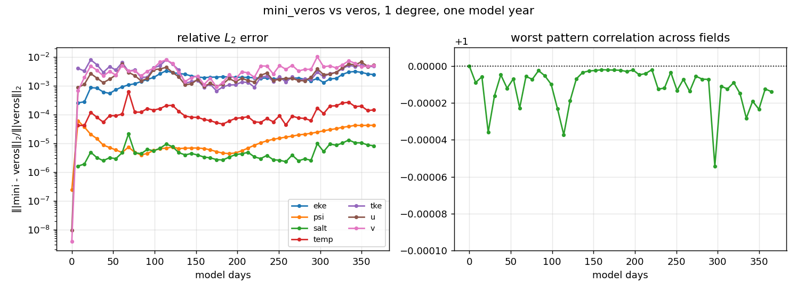
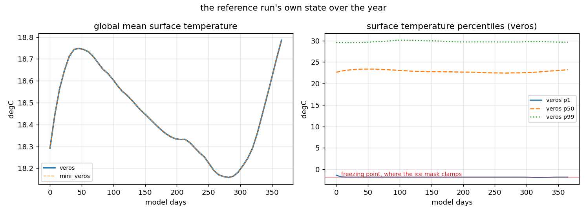
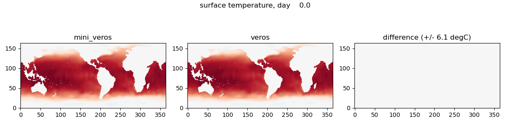

# mini_veros vs veros at 1 degree, over one model year

Generated by `test/plot_global_1deg_report.py` from `global_1deg__20260905T153646Z.npz`. Companion to `matrix_report.md`, which covers 31 physics configurations on small grids; this covers one configuration on a realistic one.

**The setup is `global_flexible` at 1 degree, not veros's `global_1deg`.** They share the 360x160 horizontal grid, but this has 60 vertical levels rather than 115, a different forcing file, and topography derived from ETOPO5. `global_1deg` was not usable: its forcing file could not be downloaded: ERDA's share endpoint accepts the TLS connection then returns nothing, and it does that for the 4-degree file too -- so the endpoint is down, not the file. `global_flexible`'s assets were already cached on the cluster, so it needed no download at all.

## Configuration

| | |
|---|---|
| grid | 360 x 160 x 60 = 3.46M cells |
| horizon | 35040 steps at dt = 900 s = 1.00 model years |
| records | 49, one every 7.6 days |
| device | gpu, float64 |
| elliptic solver | atol = 1e-08, as both codes ship |
| cost | mini_veros 172 ms/step, veros 354 ms/step |

## 1. Do the two codes agree?

Yes, and the disagreement does not grow. Relative $L_2$ rises to a few times $10^{-3}$ within the first ~45 days and then oscillates there for the rest of the year rather than saturating; the worst pattern correlation across all fields is 0.999986 at day 365, and the worst relative $L_2$ is 5.25e-03. This is unlike `acc` in `matrix_report.md`, which decorrelates and plateaus at its own variability -- a year at this resolution and damping is simply not in a chaotic eddying regime.



Step 0 is exact for temp, salt, tke and eke. The residual in psi and u/v is the streamfunction initialisation's own elliptic solve at atol = 1e-8 -- the same seed every global row in `matrix_report.md` carries, not a port difference.

## 2. Climatology

Mean over the run's second half, mini vs veros, against the same statistic measured on veros alone (its 3rd-quarter mean vs its 4th-quarter mean). Below 1 means the two models are closer to each other than veros is to itself over an equally long window.

| field | mini/veros mean diff (rms) | veros vs itself (rms) | ratio |
|---|---|---|---|
| eke | 8.275e-06 | 4.043e-03 | 0.002 |
| psi | 1.031e+03 | 4.591e+06 | 0.000 |
| salt | 6.247e-05 | 3.183e-02 | 0.002 |
| temp | 3.306e-04 | 3.550e-01 | 0.001 |
| tke | 1.330e-06 | 4.878e-04 | 0.003 |
| u | 2.621e-05 | 1.331e-02 | 0.002 |
| v | 2.227e-05 | 9.709e-03 | 0.002 |

Every field lands two to three orders below 1. For comparison, the `acc` family in `matrix_report.md` ranges 0.13 to 0.95 over 30 years.

## 3. Is the reference run itself sensible?

Worth asking, because a year is far outside this setup's own 10-day default `runlen` and it starts from climatology with no spin-up. Broadly yes:

- global mean surface temperature traces a clean annual cycle -- 18.29 degC at day 0, peaking near day 45, a trough around day 280, 18.79 degC at day 365. That is the seasonal signal of the monthly climatology forcing, not a drift; mini_veros overlays it to 4 decimal places at every record
- the 1st percentile sits at -1.80 degC, i.e. pinned at the freezing point where the setup's ice mask clamps the surface flux; the 99th percentile moves +0.11 K
- 872 of 38270 surface water cells (2.3%) end below -1.8 degC, which is ordinary for an ocean-only model whose only ice treatment is a flux mask; that fraction peaks near 7.6% mid-year and recovers
- 2 cells reach below -10 degC, all at the northern boundary. A localised polar artifact, not a global cold drift -- and mini_veros reproduces it rather than diverging from it



So the agreement above is not agreement on a degenerate state. It is not a spun-up, scientifically validated integration either, and nothing here should be read as a statement about the physics -- only about the port.

## 4. Surface temperature, side by side

mini_veros, veros, and their difference, every 7.6 days through the year.



## Reproducing

```
python test/generate_matrix_data.py --variant global_1deg \
    --steps 35040 --record-interval 730 --snapshot-surface-only \
    --device gpu --run-timestamp <TS>
python test/plot_global_1deg_report.py --timestamp <TS>
```

`--snapshot-surface-only` matters here: the gif renders only the uppermost level, and every metric is reduced from the full state before storage, so keeping the other 59 levels would cost 5.5 GB to store nothing anyone reads. With it the run is ~94 MB.
