# mini_veros vs veros: comparison matrix report

timestamp: latest -> `20260828T082645Z` (2026-08-28 08:26:45 UTC).

18/31 variants within tolerance (rel error < 1e-06, psi scale-normalized < 1e-06).

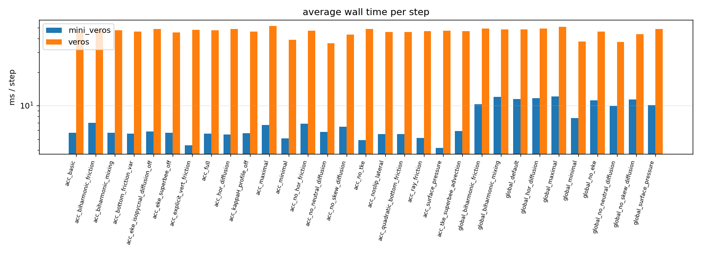

| variant | group | status | worst error | mini ms/step | veros ms/step | speedup |
|---|---|---|---|---|---|---|
| acc_basic | acc | ok | 2.28e-03 | 3.62 | 13.69 | 3.8x |
| acc_biharmonic_friction | acc | ok | 5.85e-04 | 3.99 | 12.70 | 3.2x |
| acc_biharmonic_mixing | acc | ok | 2.66e-03 | 4.44 | 12.57 | 2.8x |
| acc_bottom_friction_var | acc | ok | 8.78e-04 | 3.69 | 12.33 | 3.3x |
| acc_eke_isopycnal_diffusion_off | acc | ok | 2.75e-04 | 4.34 | 13.72 | 3.2x |
| acc_eke_superbee_off | acc | ok | 4.86e-04 | 4.38 | 12.93 | 3.0x |
| acc_explicit_vert_friction | acc | ok | 4.20e-04 | 2.92 | 12.30 | 4.2x |
| acc_full | acc | ok | 3.80e-04 | 4.61 | 14.08 | 3.1x |
| acc_hor_diffusion | acc | ok | 1.72e-04 | 3.97 | 17.64 | 4.4x |
| acc_kappaH_profile_off | acc | ok | 1.55e-02 | 3.63 | 29.14 | 8.0x |
| acc_maximal | acc | FAIL | 3.33e-04 | 5.04 | 16.09 | 3.2x |
| acc_minimal | acc | ok | 1.24e-03 | 2.03 | 6.82 | 3.4x |
| acc_no_hor_friction | acc | FAIL | 2.71e-03 | 3.72 | 12.81 | 3.4x |
| acc_no_neutral_diffusion | acc | ok | 8.89e-03 | 2.79 | 8.19 | 2.9x |
| acc_no_skew_diffusion | acc | ok | 3.24e-03 | 3.49 | 10.86 | 3.1x |
| acc_no_tke | acc | ok | 4.20e-04 | 4.17 | 11.62 | 2.8x |
| acc_noslip_lateral | acc | ok | 3.12e-04 | 3.45 | 12.23 | 3.6x |
| acc_quadratic_bottom_friction | acc | ok | 4.68e-03 | 3.83 | 12.82 | 3.3x |
| acc_ray_friction | acc | ok | 4.07e-04 | 3.84 | 12.37 | 3.2x |
| acc_surface_pressure | acc | FAIL | 1.13e+00 | 3.42 | 11.95 | 3.5x |
| acc_tke_superbee_advection | acc | ok | 2.00e-02 | 4.09 | 12.45 | 3.0x |
| global_biharmonic_friction | global | FAIL | 3.27e-04 | 18.76 | 30.23 | 1.6x |
| global_biharmonic_mixing | global | FAIL | 9.73e-04 | 20.20 | 31.79 | 1.6x |
| global_default | global | FAIL | 6.48e-03 | 18.90 | 30.71 | 1.6x |
| global_hor_diffusion | global | FAIL | 1.40e-03 | 19.48 | 40.34 | 2.1x |
| global_maximal | global | FAIL | 4.51e-02 | 18.78 | 33.01 | 1.8x |
| global_minimal | global | FAIL | 1.50e-02 | 13.27 | 18.00 | 1.4x |
| global_no_eke | global | FAIL | 6.34e-04 | 17.60 | 27.80 | 1.6x |
| global_no_neutral_diffusion | global | FAIL | 1.47e-03 | 14.37 | 19.83 | 1.4x |
| global_no_skew_diffusion | global | FAIL | 4.60e-03 | 17.83 | 26.58 | 1.5x |
| global_surface_pressure | global | FAIL | 9.47e+06 | 16.24 | 29.29 | 1.8x |

## per-variant detail

### acc_basic (ok)
generated: `20260828T082645Z`, 300 steps @ interval 10

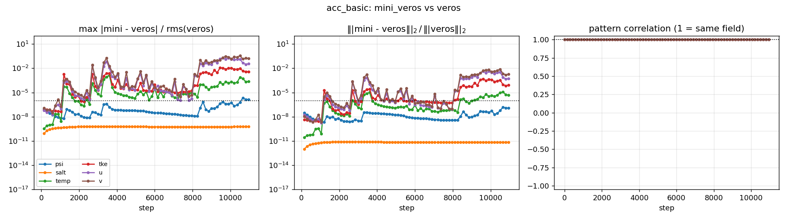

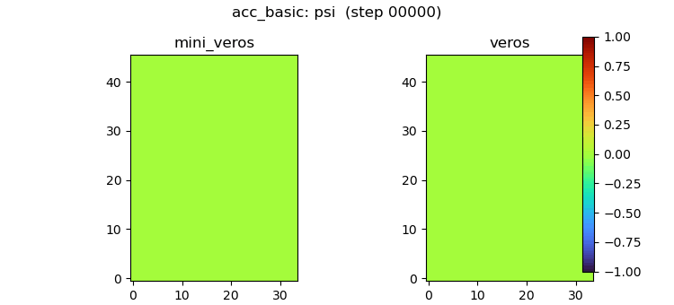

### acc_biharmonic_friction (ok)
overrides: `{'enable_hor_friction': False, 'enable_biharmonic_friction': True, 'A_hbi': 100000000000.0}`
generated: `20260828T082645Z`, 300 steps @ interval 10

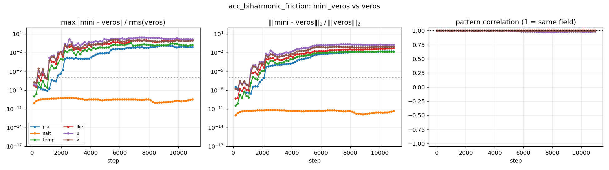

### acc_biharmonic_mixing (ok)
overrides: `{'enable_biharmonic_mixing': True, 'K_hbi': 100000000000.0}`
generated: `20260828T082645Z`, 300 steps @ interval 10

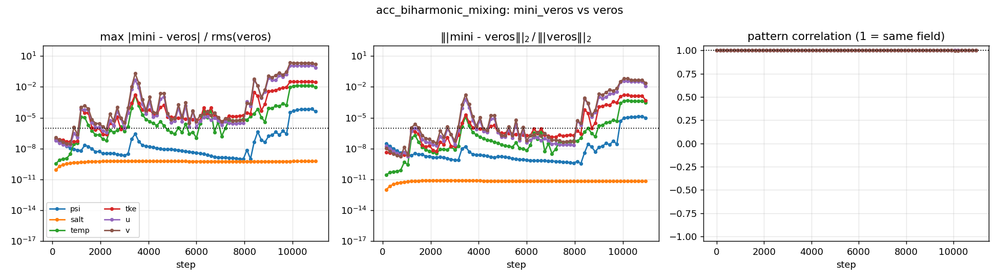

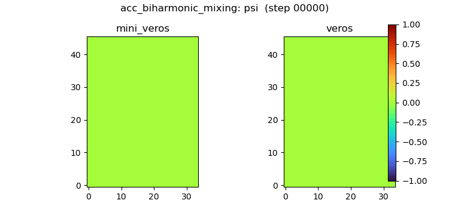

### acc_bottom_friction_var (ok)
overrides: `{'enable_bottom_friction_var': True}`
generated: `20260828T082645Z`, 300 steps @ interval 10

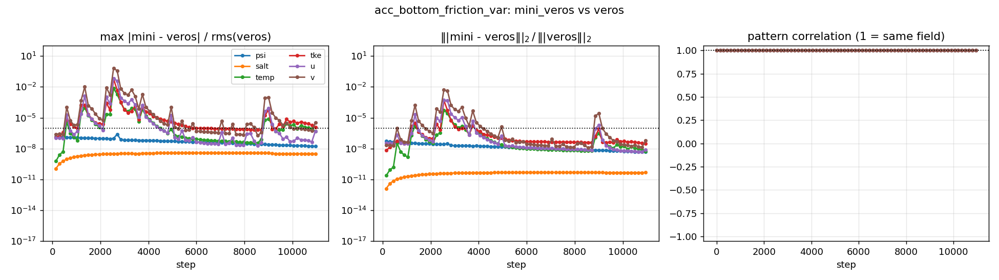

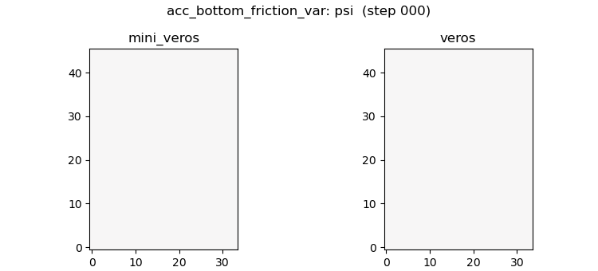

### acc_eke_isopycnal_diffusion_off (ok)
overrides: `{'enable_eke_isopycnal_diffusion': False}`
generated: `20260828T082645Z`, 300 steps @ interval 10

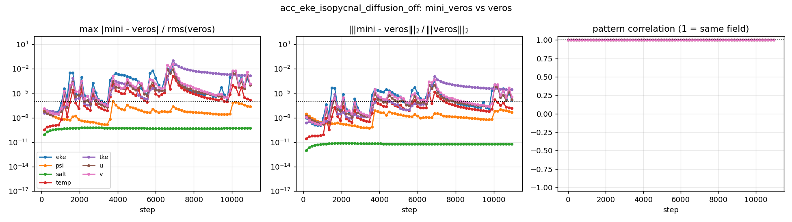

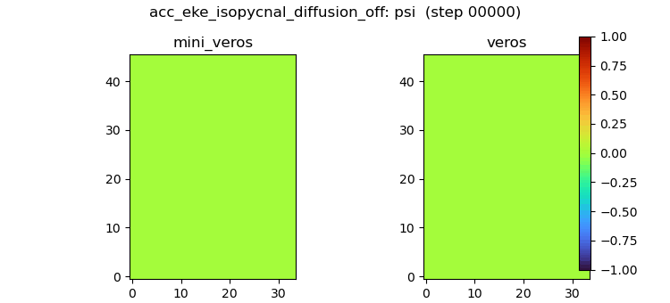

### acc_eke_superbee_off (ok)
overrides: `{'enable_eke_superbee_advection': False}`
generated: `20260828T082645Z`, 300 steps @ interval 10

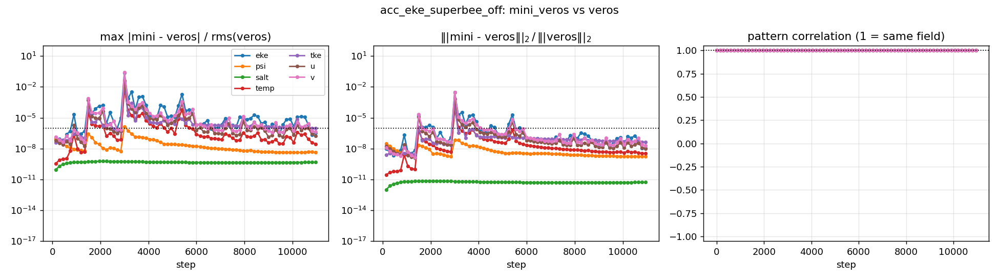

### acc_explicit_vert_friction (ok)
overrides: `{'enable_implicit_vert_friction': False, 'enable_explicit_vert_friction': True, 'enable_tke': False}`
generated: `20260828T082645Z`, 300 steps @ interval 10

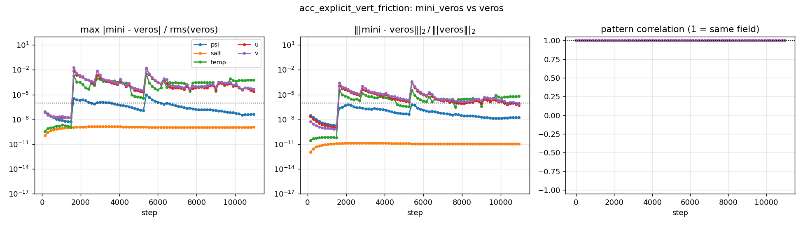
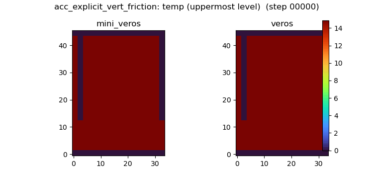

### acc_full (ok)
generated: `20260828T082645Z`, 300 steps @ interval 10

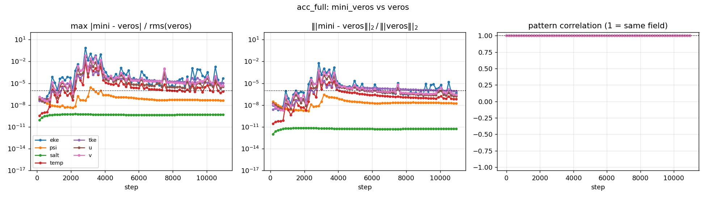

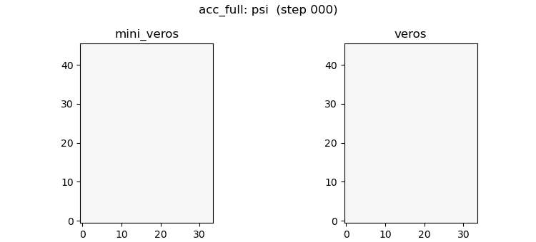

### acc_hor_diffusion (ok)
overrides: `{'enable_hor_diffusion': True, 'K_h': 1000.0}`
generated: `20260828T082645Z`, 300 steps @ interval 10

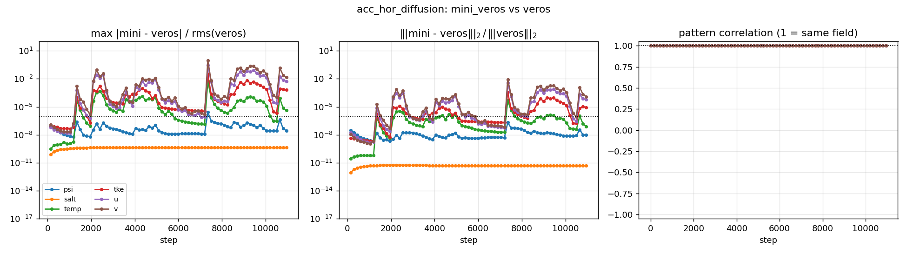

### acc_kappaH_profile_off (ok)
overrides: `{'enable_kappaH_profile': False}`
generated: `20260828T082645Z`, 300 steps @ interval 10

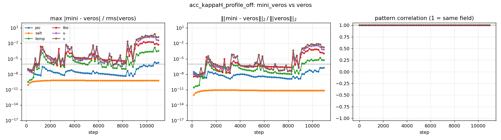

### acc_maximal (FAIL)
overrides: `{'enable_biharmonic_friction': True, 'A_hbi': 100000000000.0, 'enable_noslip_lateral': True, 'enable_quadratic_bottom_friction': True, 'r_quad_bot': 0.001, 'enable_hor_diffusion': True, 'K_h': 1000.0, 'enable_biharmonic_mixing': True, 'K_hbi': 100000000000.0, 'enable_tke_superbee_advection': True}`
generated: `20260828T082645Z`, 300 steps @ interval 10

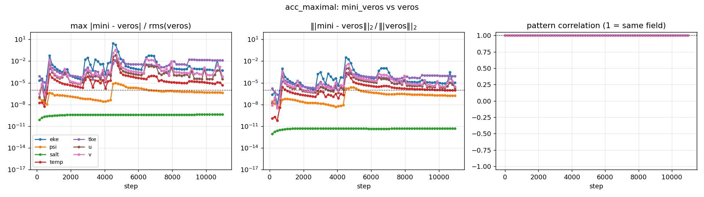

### acc_minimal (ok)
overrides: `{'enable_hor_friction': False, 'enable_bottom_friction': False, 'enable_neutral_diffusion': False, 'enable_skew_diffusion': False, 'enable_tke': False}`
generated: `20260828T082645Z`, 300 steps @ interval 10

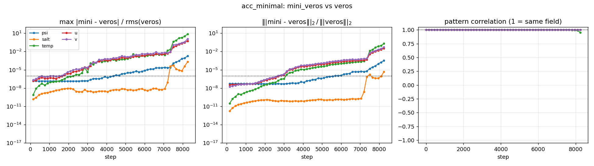

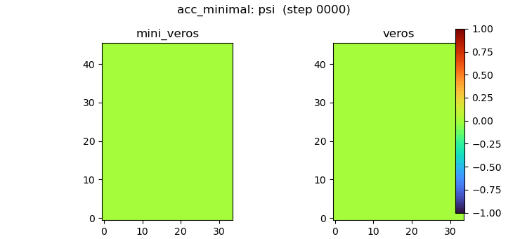

### acc_no_hor_friction (FAIL)
overrides: `{'enable_hor_friction': False}`
generated: `20260828T082645Z`, 300 steps @ interval 10

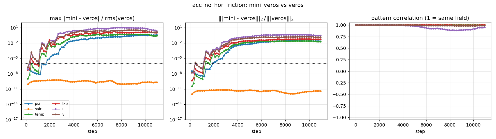

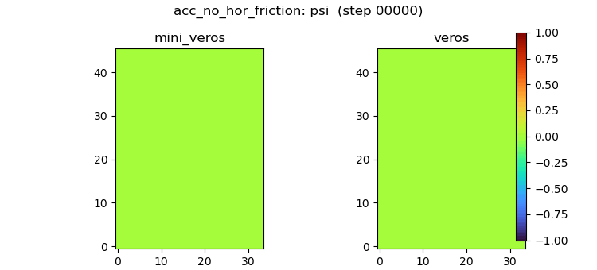

### acc_no_neutral_diffusion (ok)
overrides: `{'enable_neutral_diffusion': False, 'enable_skew_diffusion': False}`
generated: `20260828T082645Z`, 300 steps @ interval 10

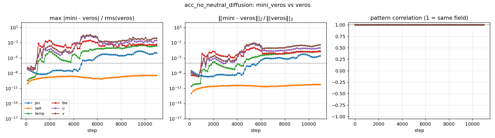

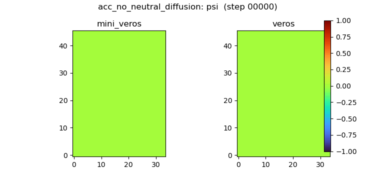

### acc_no_skew_diffusion (ok)
overrides: `{'enable_skew_diffusion': False}`
generated: `20260828T082645Z`, 300 steps @ interval 10

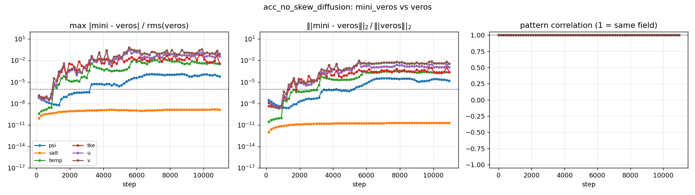

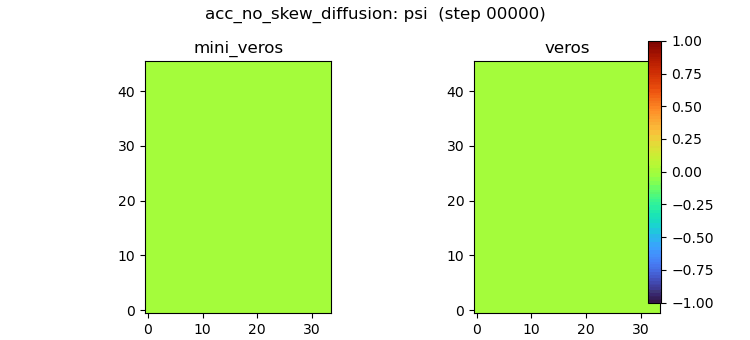

### acc_no_tke (ok)
overrides: `{'enable_tke': False}`
generated: `20260828T082645Z`, 300 steps @ interval 10

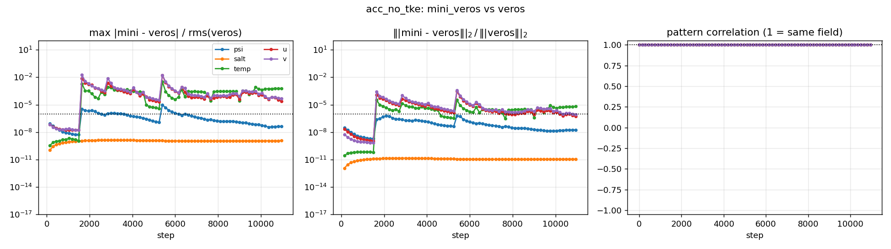

### acc_noslip_lateral (ok)
overrides: `{'enable_noslip_lateral': True}`
generated: `20260828T082645Z`, 300 steps @ interval 10

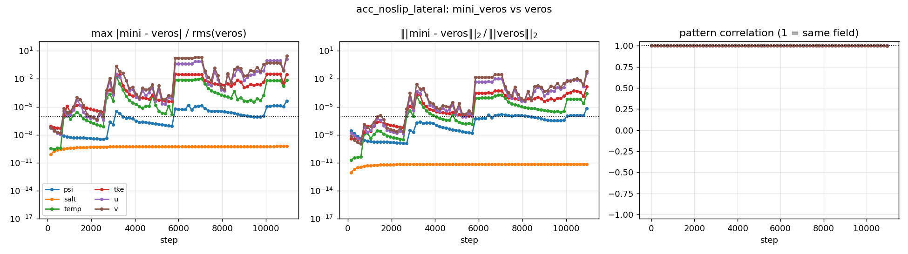

### acc_quadratic_bottom_friction (ok)
overrides: `{'enable_bottom_friction': False, 'enable_quadratic_bottom_friction': True, 'r_quad_bot': 0.001}`
generated: `20260828T082645Z`, 300 steps @ interval 10

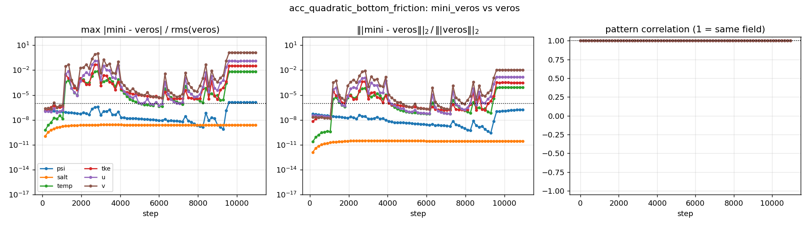

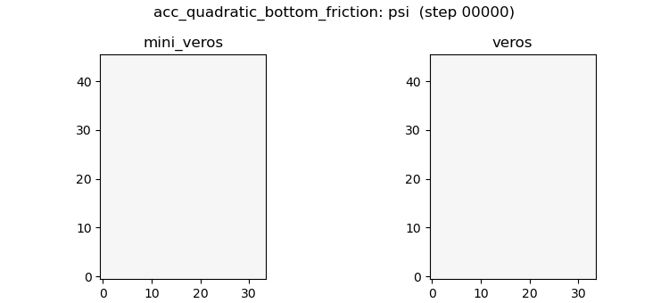

### acc_ray_friction (ok)
overrides: `{'enable_ray_friction': True, 'r_ray': 1e-06}`
generated: `20260828T082645Z`, 300 steps @ interval 10

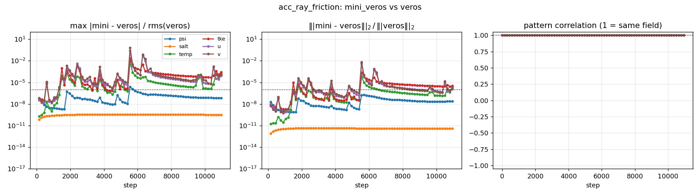

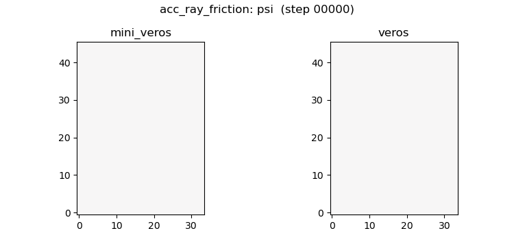

### acc_surface_pressure (FAIL)
overrides: `{'enable_streamfunction': False}`
generated: `20260828T082645Z`, 300 steps @ interval 10

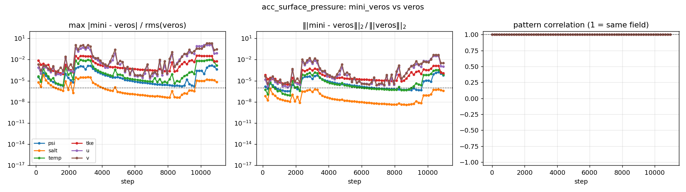

### acc_tke_superbee_advection (ok)
overrides: `{'enable_tke_superbee_advection': True}`
generated: `20260828T082645Z`, 300 steps @ interval 10

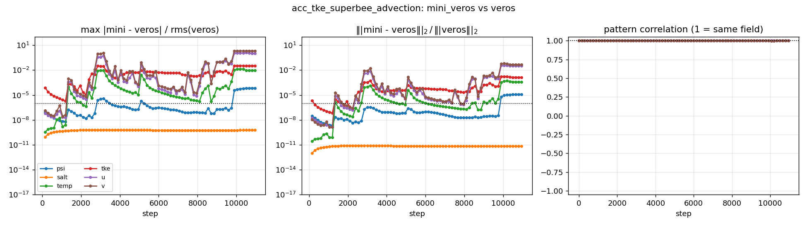

### global_biharmonic_friction (FAIL)
overrides: `{'enable_hor_friction': False, 'enable_biharmonic_friction': True, 'A_hbi': 1000000000000.0}`
generated: `20260828T082645Z`, 60 steps @ interval 5

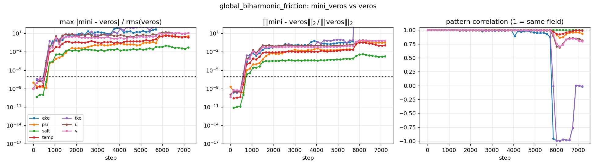
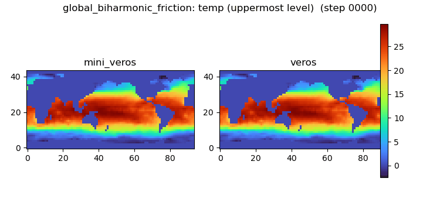
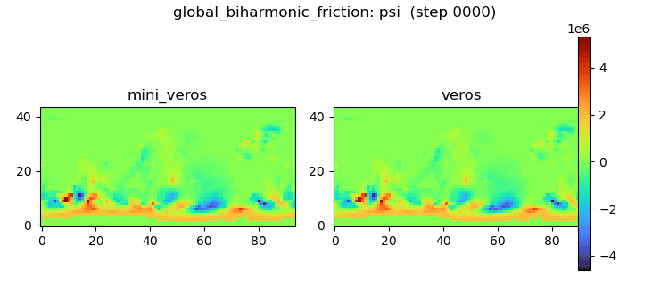

### global_biharmonic_mixing (FAIL)
overrides: `{'enable_biharmonic_mixing': True, 'K_hbi': 1000000000000.0}`
generated: `20260828T082645Z`, 60 steps @ interval 5

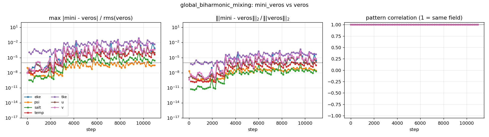

### global_default (FAIL)
generated: `20260828T082645Z`, 60 steps @ interval 5

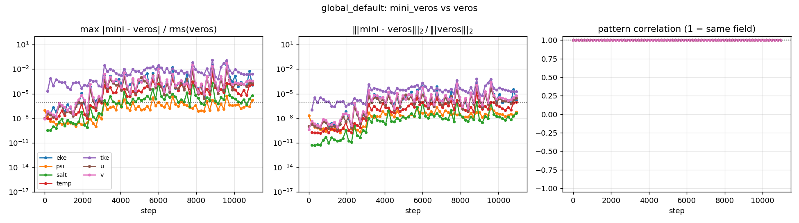

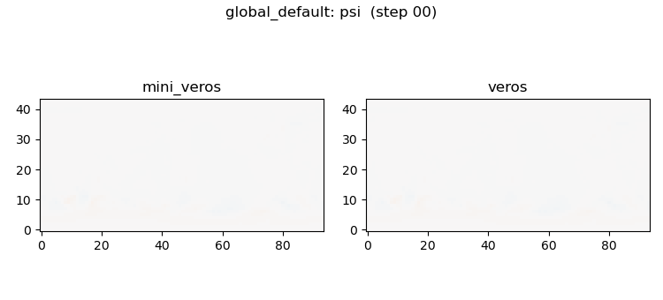

### global_hor_diffusion (FAIL)
overrides: `{'enable_hor_diffusion': True, 'K_h': 1000.0}`
generated: `20260828T082645Z`, 60 steps @ interval 5

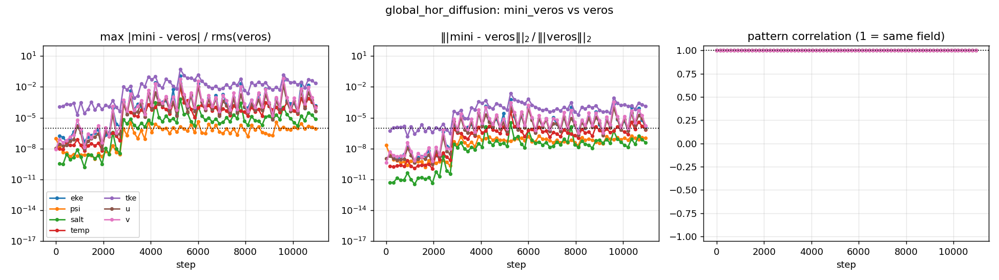

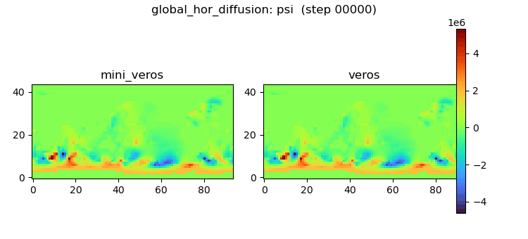

### global_maximal (FAIL)
overrides: `{'enable_biharmonic_friction': True, 'A_hbi': 1000000000000.0, 'enable_noslip_lateral': True, 'enable_hor_diffusion': True, 'K_h': 1000.0, 'enable_biharmonic_mixing': True, 'K_hbi': 1000000000000.0, 'enable_tke_superbee_advection': True, 'enable_eke_superbee_advection': True}`
generated: `20260828T082645Z`, 60 steps @ interval 5

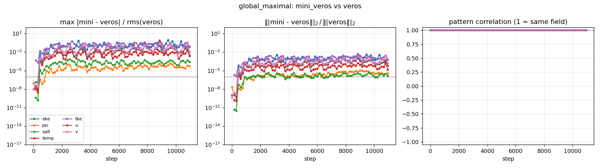
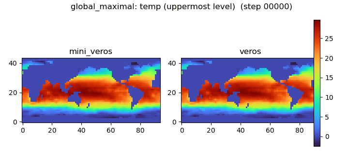
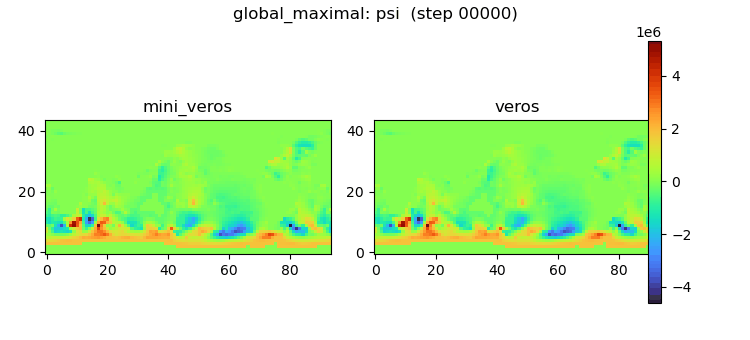

### global_minimal (FAIL)
overrides: `{'enable_hor_friction': False, 'enable_neutral_diffusion': False, 'enable_skew_diffusion': False, 'enable_eke': False}`
generated: `20260828T082645Z`, 60 steps @ interval 5

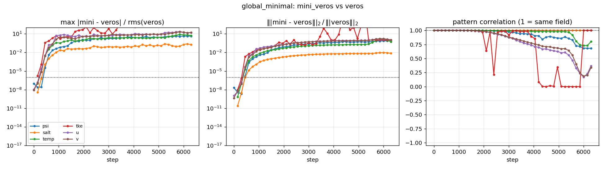

### global_no_eke (FAIL)
overrides: `{'enable_eke': False}`
generated: `20260828T082645Z`, 60 steps @ interval 5

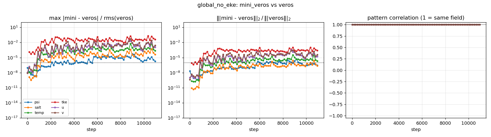

### global_no_neutral_diffusion (FAIL)
overrides: `{'enable_neutral_diffusion': False, 'enable_skew_diffusion': False}`
generated: `20260828T082645Z`, 60 steps @ interval 5

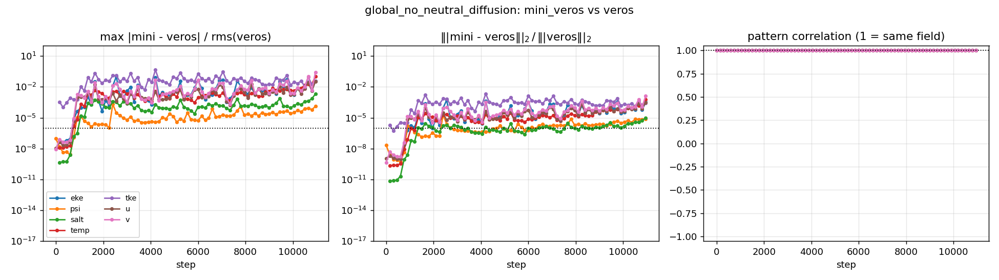

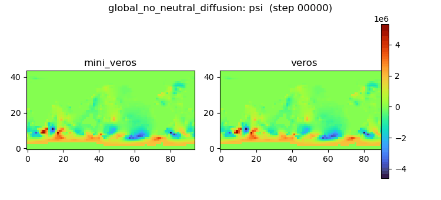

### global_no_skew_diffusion (FAIL)
overrides: `{'enable_skew_diffusion': False}`
generated: `20260828T082645Z`, 60 steps @ interval 5

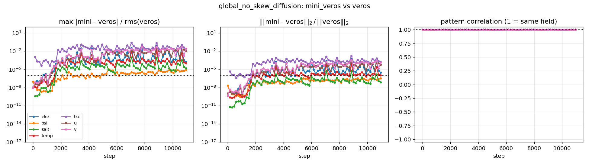

### global_surface_pressure (FAIL)
overrides: `{'enable_streamfunction': False}`
generated: `20260828T082645Z`, 60 steps @ interval 5

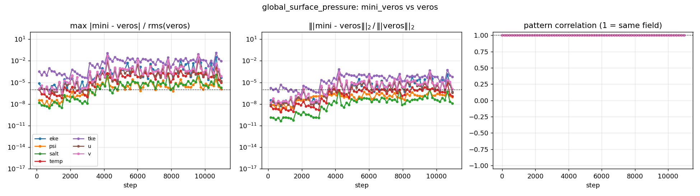

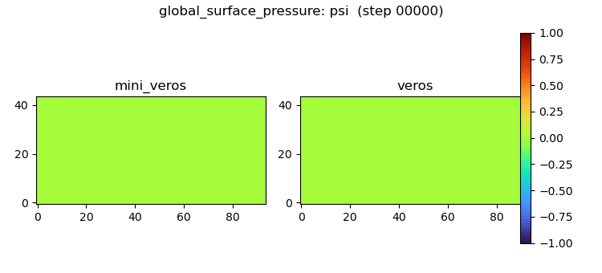
