# mini_veros vs veros: comparison matrix report

<!-- AUTO:timestamp -->
> **Warning: 1 variant(s) have no result in this run:** `global_1deg`. Their rows are empty rather than filled from an earlier run. Rerun them with `--run-id 93cl8gvn --variant <name>` to complete the set.

run: `93cl8gvn`, generated `20260916T110625Z`..`20260916T114826Z` (2026-09-16 11:06:25 UTC to 2026-09-16 11:48:26 UTC). Elliptic solver forced to atol=1e-08 on both sides -- the tolerance both codes ship with. Run on gpu.
<!-- /AUTO:timestamp -->

31 variants.

**How to read this.** A 30-year run cannot agree point-wise -- roundoff-level differences grow to the size of the flow's own variability, and real veros does the same against itself (see `divergence_report.md`). The numbers below quantify how far apart the two models are without collapsing that into a pass/fail call; **clim ratio** below 1.0 means the models are closer to each other than veros is to itself over an equally long window, which is the strongest claim a 30-year comparison can support.

Columns: **horizon** is the last step at which every field still agreed to a scale-normalized max error below 1e-06 (`>` means it never stopped agreeing); **rel L2** is the relative L2 distance at the final step; **corr** is the worst field's pattern correlation there; **clim ratio** is the climatology difference divided by veros's own. Fields the reference run holds essentially constant (acc's `salt`) are left out of the ratio: there the comparison would be roundoff over roundoff. They are judged on rel L2 like everything else. Definitions below.

## Metrics

For one field at one recorded step, let $m$ and $v$ be the mini_veros and veros fields flattened over the grid, $N$ their length, and $\overline{x}$ a spatial mean. Cells where either side is not finite are dropped before any of this.

**Scale-normalized max error :** The largest point-wise disagreement, divided by the reference field's own magnitude :

$$
\mathrm{max\_norm} \;=\; \frac{\max_i \left| m_i - v_i \right|}{\mathrm{rms}(v)}, \qquad \mathrm{rms}(x) = \sqrt{\frac{1}{N}\sum_{i=1}^{N} x_i^2}
$$

$$\mathrm{max\_norm} \;=\; \frac{\max_i \left| m_i - v_i \right|}{\mathrm{rms}(v)}, \qquad \mathrm{rms}(x) = \sqrt{\frac{1}{N}\sum_{i=1}^{N} x_i^2}$$

**Relative $L_2$ error :** The whole-field distance :

$$
\mathrm{rel\_L2} \;=\; \frac{\| m - v \|_2}{\| v \|_2}
$$

$$\mathrm{rel\_L2} \;=\; \frac{\| m - v \|_2}{\| v \|_2}$$

**Pattern correlation :** The Pearson correlation of the two fields' anomalies : 1 if same structure even shift by an offset :

$$
\mathrm{corr} \;=\; \frac{\sum_i (m_i - \overline{m})(v_i - \overline{v})}{\| m - \overline{m} \|_2 \; \| v - \overline{v} \|_2}
$$

**Agreement horizon :** The first recorded step at which any field's $\mathrm{max\_norm}$ crosses $\varepsilon = 10^{-6}$. 

$$
T_{\mathrm{agree}} = \min \{ t \text{s.t} \mathrm{max\_norm}(t) > \varepsilon \}
$$

$$\mathrm{corr} \;=\; \frac{\sum_i (m_i - \overline{m})(v_i - \overline{v})}{\| m - \overline{m} \|_2 \; \| v - \overline{v} \|_2}$$

**Climatology ratio :** compare average fields agains veros time variability

$$T_{\mathrm{agree}} \;=\; \min\left\{\, t \;:\; \mathrm{max\_norm}(t) > \varepsilon \,\right\}$$

**Climatology ratio.** The one statement that survives chaotic separation. Write $\langle x \rangle_{A}$ for the time mean over a window $A$ of records, and split a run of $R$ records into its second half $H$ and its third and fourth quarters $Q_3, Q_4$. Then $D$ is how far apart the two models' climatologies are, and $S$ is how far veros lands from *itself* when the same statistic is measured over two successive windows of the same length:

$$D \;=\; \langle m \rangle_{H} - \langle v \rangle_{H}, \qquad S \;=\; \langle v \rangle_{Q_3} - \langle v \rangle_{Q_4}, \qquad \mathrm{clim\ ratio} \;=\; \frac{\mathrm{rms}(D)}{\mathrm{rms}(S)}$$

A ratio below 1 means the two models agree with each other better than veros agrees with itself over an equally long window -- the strongest claim a 30-year comparison of a chaotic flow can support. The ratio is only reported where veros actually varies, $\mathrm{rms}(S) > 10^{-8} \cdot \mathrm{rms}(v)$; below that the field is effectively constant and the ratio is roundoff divided by roundoff (acc's `salt` scored 41 that way).

<!-- AUTO:timing -->

<!-- /AUTO:timing -->

<!-- AUTO:table -->
| variant | group | horizon | rel L2 | corr | clim ratio | mini ms/step | veros ms/step | speedup |
|---|---|---|---|---|---|---|---|---|
| acc_basic | acc | 900 | 1.92e-03 | 1.0000 | 0.01 | 5.67 | 45.18 | 8.0x |
| acc_biharmonic_friction | acc | 450 | 1.88e-01 | 0.9819 | 0.17 | 6.98 | 47.99 | 6.9x |
| acc_biharmonic_mixing | acc | 900 | 2.36e-02 | 0.9997 | 0.17 | 5.69 | 47.57 | 8.4x |
| acc_bottom_friction_var | acc | 600 | 6.16e-08 | 1.0000 | 0.00 | 5.57 | 46.19 | 8.3x |
| acc_eke_isopycnal_diffusion_off | acc | 1200 | 2.83e-05 | 1.0000 | 0.00 | 5.84 | 48.94 | 8.4x |
| acc_eke_superbee_off | acc | 900 | 4.36e-08 | 1.0000 | 0.00 | 5.72 | 45.52 | 8.0x |
| acc_explicit_vert_friction | acc | 1650 | 6.35e-06 | 1.0000 | 0.00 | 4.41 | 47.96 | 10.9x |
| acc_full | acc | 900 | 8.71e-07 | 1.0000 | 0.00 | 5.58 | 47.58 | 8.5x |
| acc_hor_diffusion | acc | 1350 | 1.25e-04 | 1.0000 | 0.00 | 5.50 | 48.65 | 8.8x |
| acc_kappaH_profile_off | acc | 750 | 1.88e-03 | 1.0000 | 0.01 | 5.63 | 46.28 | 8.2x |
| acc_maximal | acc | 150 | 8.62e-05 | 1.0000 | 0.00 | 6.69 | 51.86 | 7.8x |
| acc_minimal | acc | 1500 | - | - | - | 5.06 | 39.09 | 7.7x |
| acc_no_hor_friction | acc | 300 | 3.11e-01 | 0.9496 | 0.53 | 6.89 | 47.03 | 6.8x |
| acc_no_neutral_diffusion | acc | 900 | 4.12e-03 | 1.0000 | 0.00 | 5.78 | 36.16 | 6.3x |
| acc_no_skew_diffusion | acc | 1050 | 3.58e-03 | 1.0000 | 0.01 | 6.43 | 43.41 | 6.8x |
| acc_no_tke | acc | 1650 | 6.35e-06 | 1.0000 | 0.00 | 4.89 | 48.77 | 10.0x |
| acc_noslip_lateral | acc | 750 | 6.75e-02 | 0.9977 | 0.08 | 5.54 | 45.71 | 8.2x |
| acc_quadratic_bottom_friction | acc | 600 | 1.09e-02 | 0.9999 | 0.05 | 5.55 | 45.58 | 8.2x |
| acc_ray_friction | acc | 600 | 3.44e-06 | 1.0000 | 0.00 | 5.13 | 46.58 | 9.1x |
| acc_surface_pressure | acc | 150 | 3.30e-03 | 1.0000 | 0.07 | 4.16 | 46.92 | 11.3x |
| acc_tke_superbee_advection | acc | 150 | 4.41e-02 | 0.9990 | 0.18 | 5.91 | 46.57 | 7.9x |
| global_biharmonic_friction | global | 600 | - | - | - | 10.27 | 49.30 | 4.8x |
| global_biharmonic_mixing | global | 150 | 4.58e-05 | 1.0000 | 0.00 | 11.94 | 48.46 | 4.1x |
| global_default | global | 150 | 1.95e-05 | 1.0000 | 0.00 | 11.43 | 48.19 | 4.2x |
| global_hor_diffusion | global | 150 | 1.30e-04 | 1.0000 | 0.00 | 11.63 | 49.00 | 4.2x |
| global_maximal | global | 150 | 6.78e-04 | 1.0000 | 0.00 | 12.12 | 50.74 | 4.2x |
| global_minimal | global | 150 | - | - | - | 7.72 | 37.59 | 4.9x |
| global_no_eke | global | 150 | 2.55e-04 | 1.0000 | 0.00 | 11.15 | 46.06 | 4.1x |
| global_no_neutral_diffusion | global | 150 | 1.37e-03 | 1.0000 | 0.00 | 9.88 | 37.40 | 3.8x |
| global_no_skew_diffusion | global | 150 | 1.74e-04 | 1.0000 | 0.00 | 11.35 | 43.70 | 3.8x |
| global_surface_pressure | global | 150 | 6.17e-05 | 1.0000 | 0.00 | 10.08 | 48.91 | 4.9x |
| global_1deg | global_1deg | - | - | - | - | - | - | - |
<!-- /AUTO:table -->

## per-variant detail

<!-- AUTO:detail -->
### acc_basic
generated: `20260916T110625Z`, 10950 steps @ interval 150

### acc_biharmonic_friction
overrides: `{'enable_hor_friction': False, 'enable_biharmonic_friction': True, 'A_hbi': 100000000000.0}`
generated: `20260916T110710Z`, 10950 steps @ interval 150

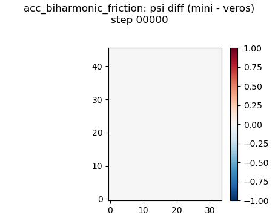

### acc_biharmonic_mixing
overrides: `{'enable_biharmonic_mixing': True, 'K_hbi': 100000000000.0}`
generated: `20260916T111701Z`, 10950 steps @ interval 150

### acc_bottom_friction_var
overrides: `{'enable_bottom_friction_var': True}`
generated: `20260916T111624Z`, 10950 steps @ interval 150

### acc_eke_isopycnal_diffusion_off
overrides: `{'enable_eke_isopycnal_diffusion': False}`
generated: `20260916T112648Z`, 10950 steps @ interval 150

### acc_eke_superbee_off
overrides: `{'enable_eke_superbee_advection': False}`
generated: `20260916T112615Z`, 10950 steps @ interval 150

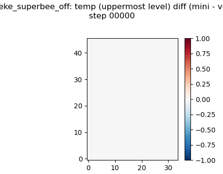
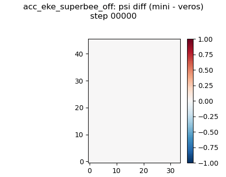

### acc_explicit_vert_friction
overrides: `{'enable_implicit_vert_friction': False, 'enable_explicit_vert_friction': True, 'enable_tke': False}`
generated: `20260916T110642Z`, 10950 steps @ interval 150

### acc_full
generated: `20260916T110650Z`, 10950 steps @ interval 150

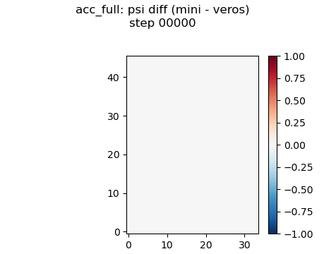

### acc_hor_diffusion
overrides: `{'enable_hor_diffusion': True, 'K_h': 1000.0}`
generated: `20260916T111702Z`, 10950 steps @ interval 150

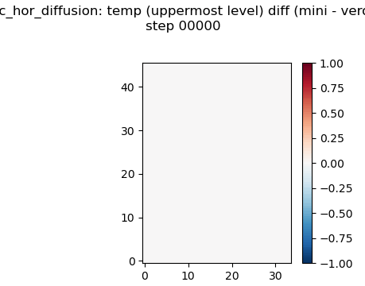
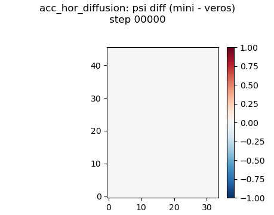

### acc_kappaH_profile_off
overrides: `{'enable_kappaH_profile': False}`
generated: `20260916T112642Z`, 10950 steps @ interval 150

### acc_maximal
overrides: `{'enable_biharmonic_friction': True, 'A_hbi': 100000000000.0, 'enable_noslip_lateral': True, 'enable_quadratic_bottom_friction': True, 'r_quad_bot': 0.001, 'enable_hor_diffusion': True, 'K_h': 1000.0, 'enable_biharmonic_mixing': True, 'K_hbi': 100000000000.0, 'enable_tke_superbee_advection': True}`
generated: `20260916T112813Z`, 10950 steps @ interval 150

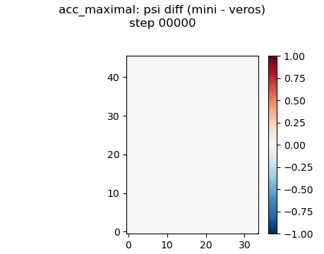

### acc_minimal
overrides: `{'enable_hor_friction': False, 'enable_bottom_friction': False, 'enable_neutral_diffusion': False, 'enable_skew_diffusion': False, 'enable_tke': False}`
generated: `20260916T112349Z`, 10950 steps @ interval 150

note: diverged mid-run; rel L2/corr/clim ratio omitted (they'd measure the explosion, not the port)

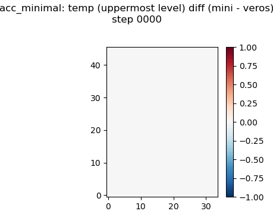
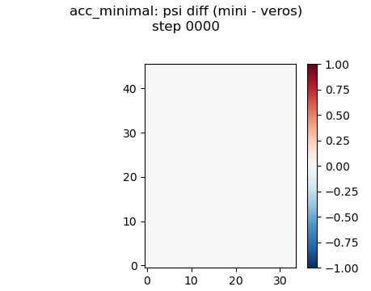

### acc_no_hor_friction
overrides: `{'enable_hor_friction': False}`
generated: `20260916T110658Z`, 10950 steps @ interval 150

### acc_no_neutral_diffusion
overrides: `{'enable_neutral_diffusion': False, 'enable_skew_diffusion': False}`
generated: `20260916T111507Z`, 10950 steps @ interval 150

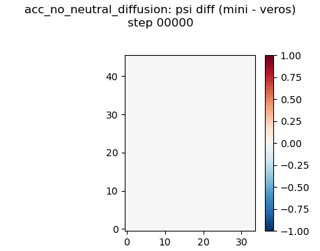

### acc_no_skew_diffusion
overrides: `{'enable_skew_diffusion': False}`
generated: `20260916T111645Z`, 10950 steps @ interval 150

### acc_no_tke
overrides: `{'enable_tke': False}`
generated: `20260916T112523Z`, 10950 steps @ interval 150

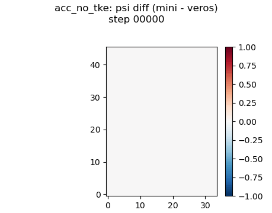

### acc_noslip_lateral
overrides: `{'enable_noslip_lateral': True}`
generated: `20260916T110630Z`, 10950 steps @ interval 150

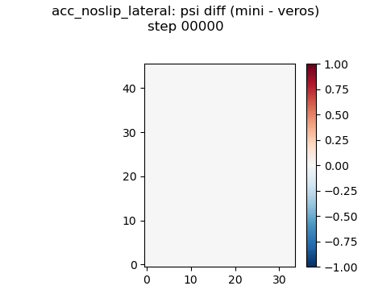

### acc_quadratic_bottom_friction
overrides: `{'enable_bottom_friction': False, 'enable_quadratic_bottom_friction': True, 'r_quad_bot': 0.001}`
generated: `20260916T111618Z`, 10950 steps @ interval 150

### acc_ray_friction
overrides: `{'enable_ray_friction': True, 'r_ray': 1e-06}`
generated: `20260916T110635Z`, 10950 steps @ interval 150

### acc_surface_pressure
overrides: `{'enable_streamfunction': False}`
generated: `20260916T111618Z`, 10950 steps @ interval 150

### acc_tke_superbee_advection
overrides: `{'enable_tke_superbee_advection': True}`
generated: `20260916T112622Z`, 10950 steps @ interval 150

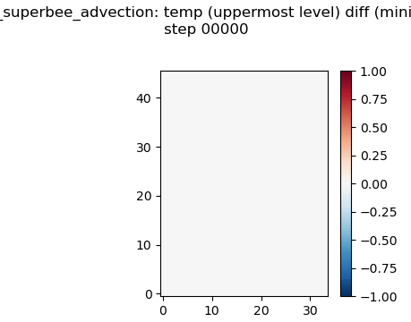

### global_biharmonic_friction
overrides: `{'enable_hor_friction': False, 'enable_biharmonic_friction': True, 'A_hbi': 1000000000000.0}`
generated: `20260916T113454Z`, 10950 steps @ interval 150

note: diverged mid-run; rel L2/corr/clim ratio omitted (they'd measure the explosion, not the port)

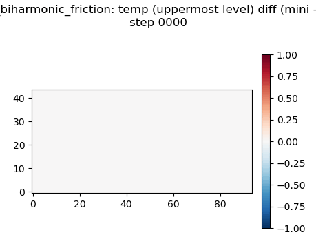

### global_biharmonic_mixing
overrides: `{'enable_biharmonic_mixing': True, 'K_hbi': 1000000000000.0}`
generated: `20260916T113821Z`, 10950 steps @ interval 150

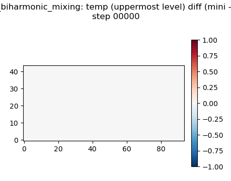

### global_default
generated: `20260916T113515Z`, 10950 steps @ interval 150

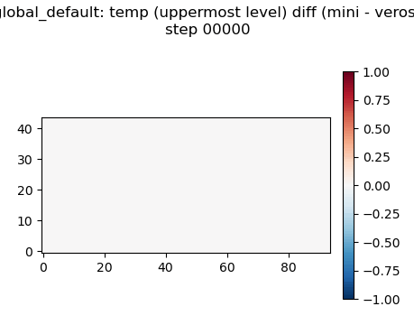

### global_hor_diffusion
overrides: `{'enable_hor_diffusion': True, 'K_h': 1000.0}`
generated: `20260916T113815Z`, 10950 steps @ interval 150

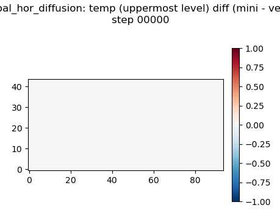

### global_maximal
overrides: `{'enable_biharmonic_friction': True, 'A_hbi': 1000000000000.0, 'enable_noslip_lateral': True, 'enable_hor_diffusion': True, 'K_h': 1000.0, 'enable_biharmonic_mixing': True, 'K_hbi': 1000000000000.0, 'enable_tke_superbee_advection': True, 'enable_eke_superbee_advection': True}`
generated: `20260916T114826Z`, 10950 steps @ interval 150

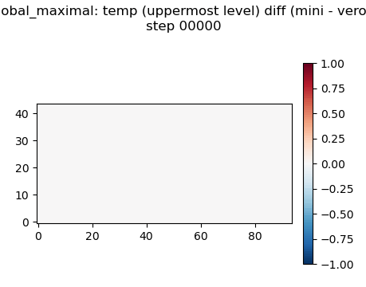
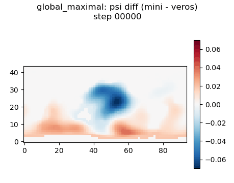

### global_minimal
overrides: `{'enable_hor_friction': False, 'enable_neutral_diffusion': False, 'enable_skew_diffusion': False, 'enable_eke': False}`
generated: `20260916T114108Z`, 10950 steps @ interval 150

note: diverged mid-run; rel L2/corr/clim ratio omitted (they'd measure the explosion, not the port)

### global_no_eke
overrides: `{'enable_eke': False}`
generated: `20260916T113620Z`, 10950 steps @ interval 150

### global_no_neutral_diffusion
overrides: `{'enable_neutral_diffusion': False, 'enable_skew_diffusion': False}`
generated: `20260916T113728Z`, 10950 steps @ interval 150

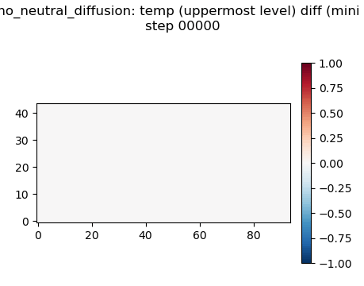
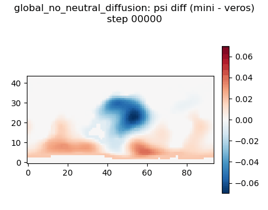

### global_no_skew_diffusion
overrides: `{'enable_skew_diffusion': False}`
generated: `20260916T114529Z`, 10950 steps @ interval 150

### global_surface_pressure
overrides: `{'enable_streamfunction': False}`
generated: `20260916T113738Z`, 10950 steps @ interval 150

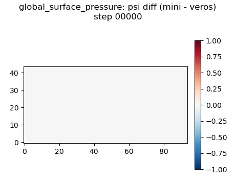

### global_1deg

no data: `no result in this run -- the variant never wrote an .npz`

<!-- /AUTO:detail -->
