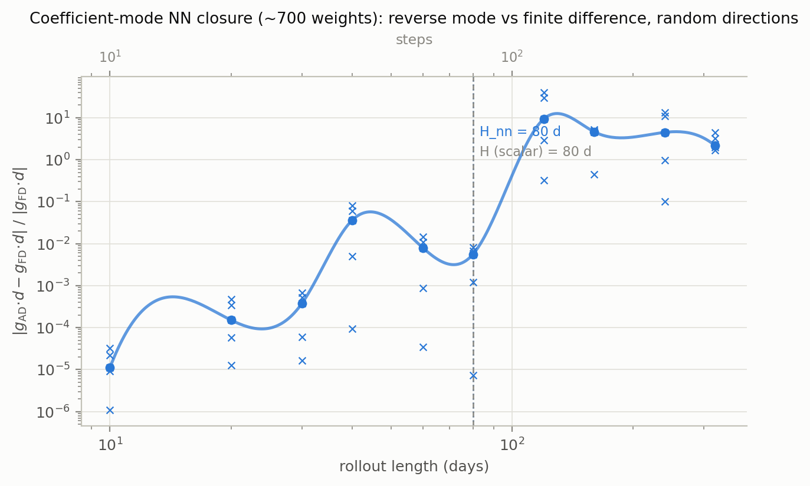
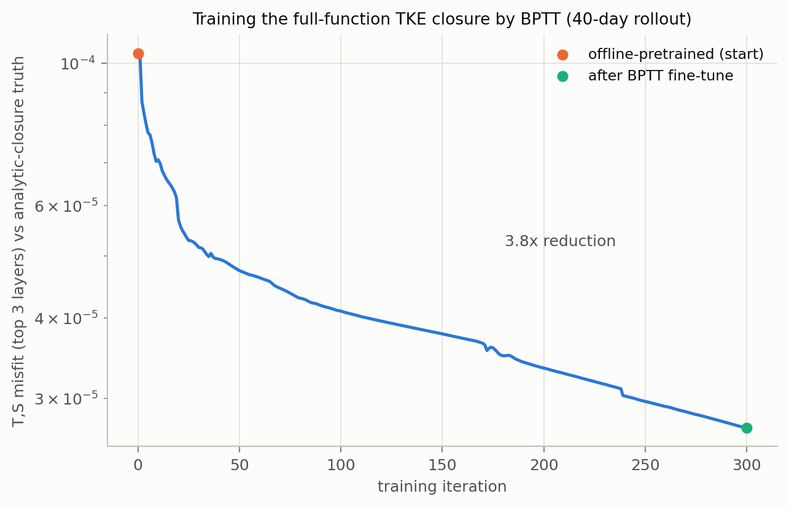
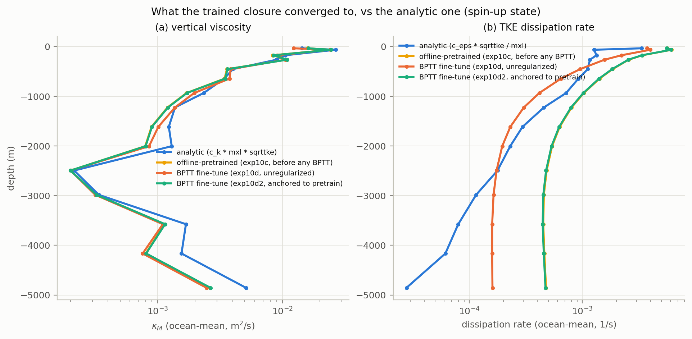
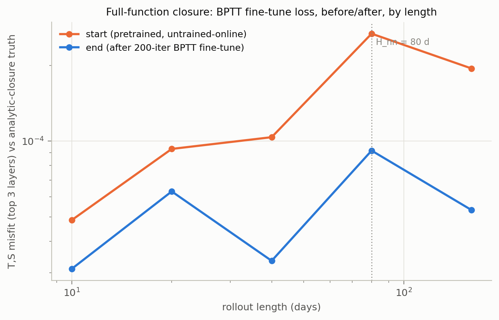

# Replacing the TKE closure with a neural network

Follow-up to `report/paper/gradients_and_limits.md`. Question: can the TKE closure (sets vertical viscosity $\kappa_M$ and TKE dissipation rate $\varepsilon$ from two scalars, $c_k$ and $c_{eps}$) be replaced by a NN, trained end-to-end through the differentiable ocean model — and does the paper's H=80-day gradient horizon survive going from 2 parameters to ~1500?

Code: `test/nn_tke/`. Model changes: `mini-veros/mini_veros/{model.py, state.py, core/tke.py}` — backward-compatible, every `test/paper_figures` experiment unaffected.

## The seam

Analytic closure:

$$
\kappa_M = c_k \cdot \ell \cdot \sqrt{\mathrm{tke}}, \qquad \varepsilon = c_{eps} \cdot \frac{\sqrt{\mathrm{tke}}}{\ell}
$$

Two NN modes, both driven by features $x = [N^2,\ \sqrt{\mathrm{tke}},\ \ell,\ z]$ (buoyancy frequency, TKE, mixing length, depth):

- **Coefficient mode** — net replaces $c_k$/$c_{eps}$, keeps the physical form.
- **Full-function mode** — net replaces the whole expression:

$$
\kappa_M = \exp(f_\theta(x)), \qquad \varepsilon = \exp(g_\theta(x))
$$

```python
# mini_veros/core/tke.py — tke_closure_fields, the one place that knows about all 3 modes
if kM_net is not None:                      # full-function
    kappaM_raw = jnp.exp(evaluate(kM_net))
else:
    ck_field = evaluate(ck_net) if ck_net is not None else params.c_k   # coefficient / default
    kappaM_raw = ck_field * mxl * sqrttke
```

All fields `None` (every existing script) ⇒ bit-identical to the original closure.

## Experiments

| | script | checks |
|---|---|---|
| 10a | `exp10a_identity_check.py` | coefficient net init'd to reproduce the constant closure exactly |
| 10b | `exp10b_gradient_check.py` | **the gate** — AD-vs-FD, random directions, ~700 weights |
| 10c | `exp10c_offline_pretrain.py` | supervised pretrain, full-function nets, log-space |
| 10d | `exp10d_online_finetune.py` | **centerpiece** — BPTT fine-tune vs exp3's twin-experiment loss |
| 10d2 | `exp10d2_regularized_finetune.py` | exp10d + L2 anchor to pretrained weights |
| 10e | `exp10e_calibration_limit.py` | exp4's question, swept over length 10-160d |

Ran on Grid5000 (L4/L40S), ~2-3 GPU-hours total.

## Findings

**1. Horizon unchanged: H_nn = 80d, exactly matches the scalar closure's H = 80d.**



More parameters (2 → ~700) did not shrink the trustworthy window.

**2. BPTT trains a full-function closure. 3.8x loss reduction (1.04e-4 → 2.70e-5), clean.**

<u>Pretraining :</u>
$$
\mathcal{L} = \frac{1}{N}\sum_i \left(f_\theta(x_i) - \log y_i\right)^2, \qquad \mathcal{L}_{\kappa_M} = 0.14\ (\log\kappa_M \in [-8.52,\ 0.86]), \qquad \mathcal{L}_{\varepsilon} = 0.29\ (\log\varepsilon \in [-13.70,\ -4.25])
$$

 $x = [N^2,\ \sqrt{\mathrm{tke}},\ \ell,\ z]$, ranges: $N^2\in[-1.86\text{e-}5,\ 9.21\text{e-}4]$, $\sqrt{\mathrm{tke}}\in[0,\ 0.0444]$, $\ell\in[1\text{e-}8,\ 1376.8]$, $z\in[-4855,\ -35]$.




**3. Bug: raw-MSE pretraining silently fails on a heavy-tailed positive target.**

$\kappa_M$/$\varepsilon$ span orders of magnitude (ocean-mean ~1e-3–6e-3, rare points up to 2.4) — raw MSE is dominated by the tail, net converges near-constant. Fix: regress $\log(\text{target})$, matching the model's own `exp()` convention. ~50% of points have *exactly* zero $\varepsilon$ (quiescent); excluded from the fit rather than log-floored.

```python
log_target_kappaM = jnp.log(jnp.maximum(target_kappaM, LOG_FLOOR))
diss_active = target_diss > DISS_ZERO_THRESHOLD          # drop exact zeros
log_target_diss = jnp.log(target_diss[diss_active])
```



Pretrain went from flat-and-wrong to tracking the analytic profile's shape (incl. the wiggle at 2000–4200m). Fine-tune start loss dropped **4 orders of magnitude** (2.5486 → 1.04e-4) from this fix alone, before any BPTT.

**4. Bug: unclipped late gradient spike → NaN silently overwrote good weights.**

exp10d2 diverged to NaN on iteration 299/300 after 280 clean ones (same class as `exp6_gradient_spikes.py`'s scalar-case spikes). Loop was saving the post-step (NaN) weights regardless. Fixed:

```python
opt = optax.chain(optax.clip_by_global_norm(grad_clip_norm), optax.adam(lr))
...
if np.isfinite(dl):
    best_nets = nets            # never persist a diverged step
```

No further divergence in any run after.

**5. k (10d2) buys nothing once pretraining (10c) is fixed** — see fig10f: plain fine-tune (orange) and anchored fine-tune (green) both already track analytic; anchoring just stalls improvement (9.2e-5 vs pretrained 1.04e-4, oscillating). The "null-space drift" seen before Finding 3's fix was an artifact of the bad starting point, not the shallow-observation objective itself.

**6. No sharp cliff up to 2H (unlike the scalar case's clean cliff at H).**



Start/end loss both non-monotonic in length, but end stays below start at every length tested, including past H_nn. Not evidence training is trustworthy past the horizon — just that this metric, at this iteration budget, doesn't show exp4's dramatic failure signature.

## Limitations

- 10b (gate) used coefficient mode only; full-function mode has no trivial identity-init to gradient-check against.
- 10e stops at 160d (2H); exp4 reached 320d (4H) — not extended, given per-iteration cost.
- 10c's training data: one 40-day rollout from the spin-up state — narrow slice of state space.
- fig10f checks a point-wise profile at one instant, not rollout behavior over time.
