# The 5 full-state ACC runs: configuration, state, convergence, variability

5 `(c_k, c_eps)` points from `ck_ceps_density_report.md`'s 25-run sweep (largest
deviation from the sweep's mean density profile), rerun saving the full
`PrognosticState` (u, v, temp, salt, tke, eke, psi) every 30 days for 30
model-years, instead of just the reduced density profile the sweep kept.
Grenoble L4 GPU, OAR job `3100861`. Data:
`$STORE/MiniVeros-Autodiff/results/ck_ceps_sweep/full_state/ck{c_k}_eps{c_eps}.npz`.
Code: `test/ck_ceps_sweep/`.

| c_k | c_eps |
|---|---|
| 0.4 | 0.175 |
| 0.4 | 0.35 |
| 0.2 | 0.175 |
| 0.05 | 2.8 |
| 0.05 | 1.4 |

## 1. Configuration

- Setup: `mini_veros.setups.acc.full` -- idealized zonally-periodic channel, partial "Atlantic block" landmass, TKE + EKE closures on.
- Grid: 30x42 horizontal (2 deg spacing, x in [0,60], y in [-40,44]) x 15 stretched vertical levels (thin near surface, thick at depth).
- `dt_tracer` = 43200s (12h) -> 2 steps/day, 730 steps/model-year.
- `eq_of_state_type=3` (Vallis 2008) -- density values everywhere in this report are anomalies relative to `rho0=1024 kg/m^3`, not absolute density.
- Topography: land where `x<=1 AND y>=-20` -- a thin meridional wall blocking the channel north of `y=-20`; south of it the channel is fully open/periodic (the ACC proper -- used for "channel-only" diagnostics below).
- Forcing is static (no seasonal cycle, no time dependence at all):

$$\tau_x(y) = \begin{cases} 0.1\sin\!\left(\dfrac{\pi(y_u-y_{u,\min})}{-20-y_{t,\min}}\right) & y<-20 \\ 0 & -20\le y\le 10 \\ 0.1\left(1-\cos\!\left(\dfrac{2\pi(y_u-10)}{y_{u,\max}-10}\right)\right) & y>10 \end{cases} \qquad \tau_y = 0$$

$$t^\star(y) = \begin{cases} 15\dfrac{y-y_{t,\min}}{-20-y_{t,\min}} & y<-20 \\ 15 & -20\le y\le 20 \\ 15\left(1-\dfrac{y-20}{y_{t,\max}-20}\right) & y>20 \end{cases} \qquad F_{temp} = \frac{\Delta z_{top}}{30\,\text{days}}\,(t^\star - SST)$$

  No salinity forcing (`forc_salt_surface=0`) -- salt evolves from advection/mixing alone (see Section 3). Surface TKE injection: `forc_tke_surface = (|tau|/rho0)^1.5`.
- Initial condition: `temp0(z) = 15(1 - z/z_{w,0})`, uniform `salt0=35`, zero velocity -- every run starts cold, the 30-year integration *is* the spin-up.

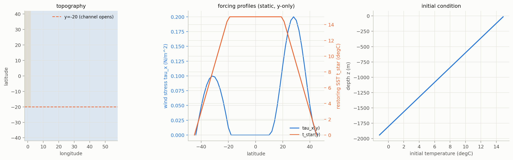

**Full config/parameters** (shared by all 5 -- only `c_k`, `c_eps` differ; regenerate with `test/ck_ceps_sweep/dump_config.py`):

```json
{
  "config": {
    "nx": 30, "ny": 42, "nz": 15, "dt_mom": 4800.0, "dt_tracer": 43200.0,
    "coord_degree": true, "enable_cyclic_x": true, "enable_conserve_energy": true,
    "eq_of_state_type": 3,
    "enable_implicit_vert_friction": true, "enable_explicit_vert_friction": false,
    "enable_TEM_friction": false,
    "enable_hor_friction": true, "enable_hor_friction_cos_scaling": true,
    "enable_biharmonic_friction": false, "enable_noslip_lateral": false,
    "enable_ray_friction": false,
    "enable_bottom_friction": true, "enable_bottom_friction_var": false,
    "enable_quadratic_bottom_friction": false, "enable_momentum_sources": false,
    "enable_streamfunction": true, "enable_superbee_advection": false,
    "enable_hor_diffusion": false, "enable_biharmonic_mixing": false,
    "enable_tempsalt_sources": false,
    "enable_neutral_diffusion": true, "enable_skew_diffusion": true,
    "enable_tke": true, "enable_eke": true,
    "enable_eke_isopycnal_diffusion": true, "enable_eke_superbee_advection": true,
    "enable_eke_upwind_advection": false, "enable_idemix": false,
    "enable_Prandtl_tke": true, "enable_store_cabbeling_heat": false,
    "enable_store_bottom_friction_tke": false, "enable_kappaH_profile": true,
    "enable_tke_hor_diffusion": false, "enable_tke_superbee_advection": false,
    "enable_tke_upwind_advection": false, "tke_mxl_choice": 2
  },
  "parameters": {
    "AB_eps": 0.1, "rho_0": 1024.0, "grav": 9.81,
    "r_ray": 0.0, "r_bot": 1e-05, "r_quad_bot": 0.0,
    "A_h": 219872.23, "A_hbi": 0.0,
    "hor_friction_cosPower": 1.0, "biharmonic_friction_cosPower": 0.0,
    "K_h": 0.0, "K_hbi": 0.0,
    "K_iso_steep": 500.0, "iso_slopec": 0.01, "iso_dslope": 0.005, "K_iso_0": 1000.0,
    "eke_lmin": 100.0, "eke_cross": 2.0, "eke_crhin": 1.0, "eke_k_max": 10000.0,
    "eke_c_k": 0.4, "eke_c_eps": 0.5, "alpha_eke": 1.0, "K_gm_0": 1000.0,
    "c_k": 0.1, "c_eps": 0.7,
    "alpha_tke": 30.0, "kappaM_max": 100.0, "kappaM_min": 0.0002, "kappaM_0": 0.0,
    "kappaH_min": 2e-05, "kappaH_0": 0.0, "mxl_min": 1e-08,
    "Prandtl_tke0": 10.0, "K_h_tke": 2000.0
  }
}
```


> [!NOTE]
> **Potential density anomaly**
> $$
> \rho' = -\left(\frac{g\,z}{c_{s0}^2} + \beta_T\left(1-\gamma_s\, g\, z\, \rho_0\right)(\theta-\theta_0) + \frac{\beta_{Ts}}{2}(\theta-\theta_0)^2 - \beta_S(S-S_0)\right)\rho_0
> $$
> `get_potential_rho`, `eq_of_state_type=3` ( `core/density/nonlinear_eq2.py`), evaluated at `press_ref=0` (surface) 
>
> | `rho0` | `theta0` | `S0` | `cs0` | `beta_T` | `beta_Ts` | `beta_S` | `gamma_s` |
> |---|---|---|---|---|---|---|---|
> | 1024 kg/m^3 | 9.85 degC | 35 | 1490 | 1.67e-4 | 1e-5 | 0.78e-3 | 1.1e-8 |

## 2. Visualizing the state

State evolution, 5 panels side by side, one frame every 150 days (73 frames), 30 years:

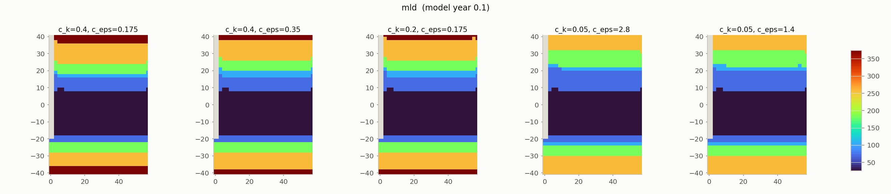
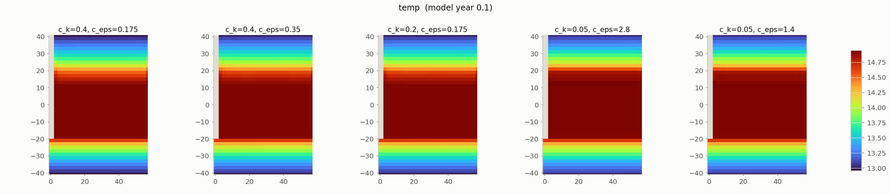

Basin-averaged prognostic fields through time (all 7 saved fields, volume/area-weighted; each run's colour shades its own local rolling-std):

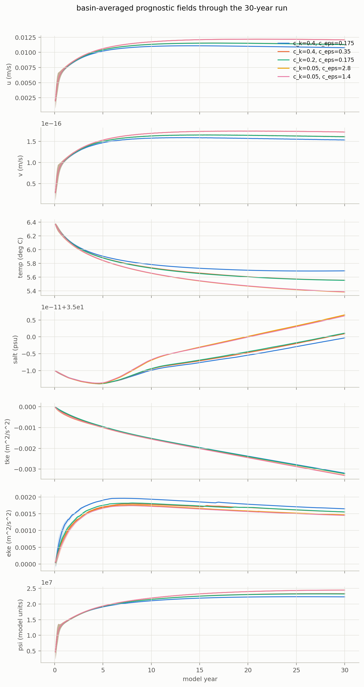

Kinetic energy in the periodic part of the channel (`y<-20`, the ACC):

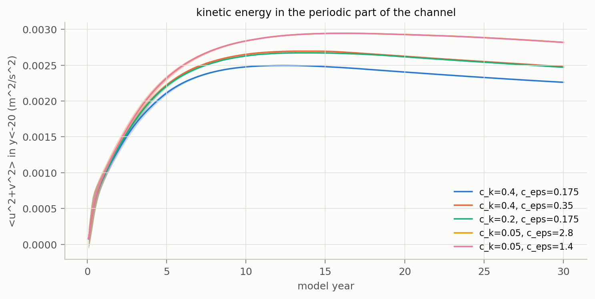

## 3. Assessing convergence

**Density**, step-to-step change `RMS(rho[t+1]-rho[t])` 

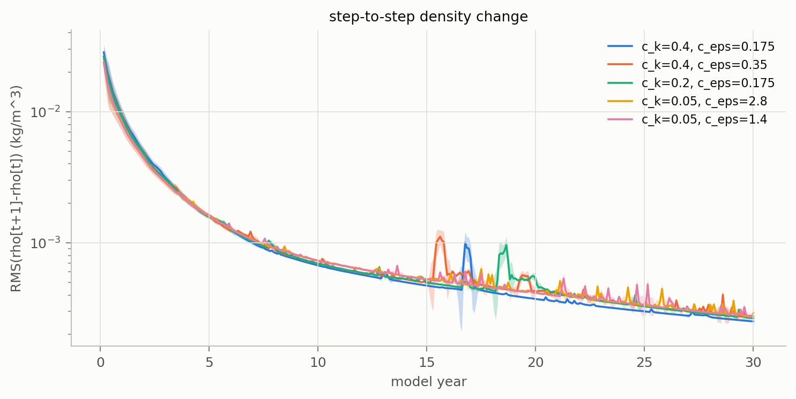

**Whole state**, same check on every saved field, each normalized by that field's own whole-run RMS (comparable scale across units)

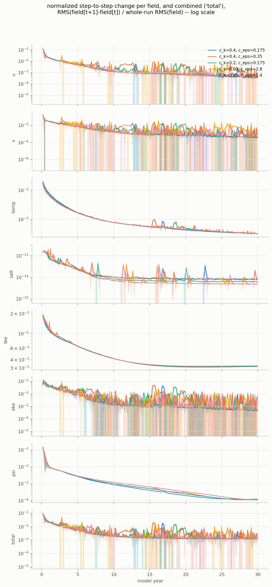

**Potential density**, final-model-year average: latitude-depth section (zonal mean) per run, and the mean profile alone (whole basin, the ACC channel only, and their difference):

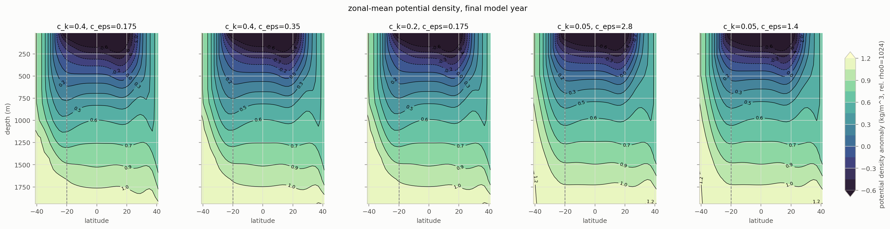
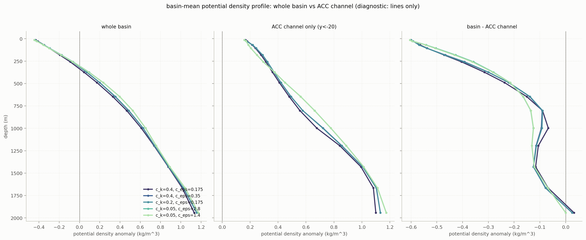

Same sections, each minus the 5-run mean:

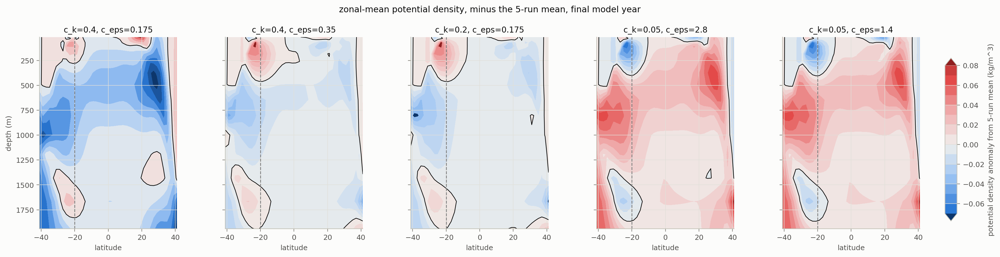

**MLD, anomaly from the 5-run mean**, final-model-year average:

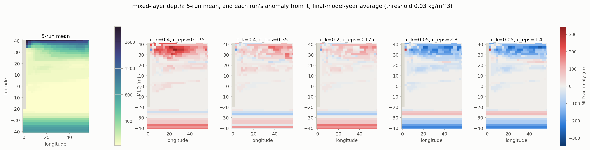

**Basin-mean MLD through time** :

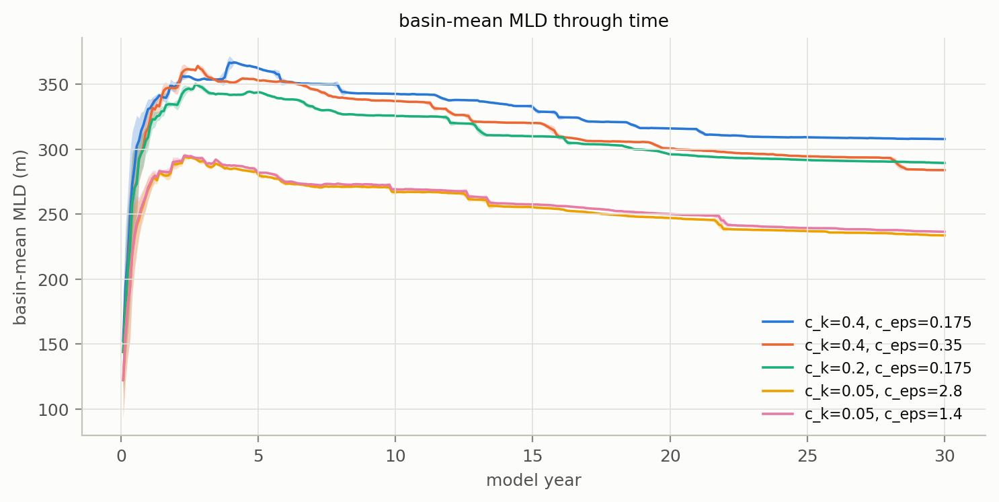

**Density profile anomalies**

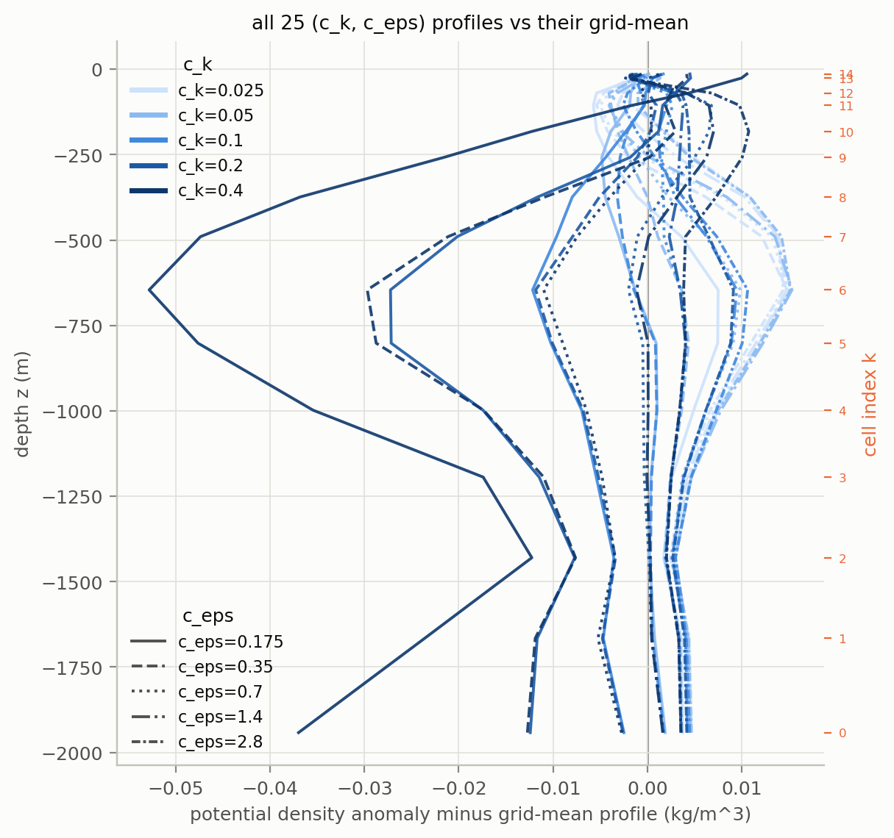
