# mini_veros vs veros: trust report

Long-rollout comparison (300 steps) per setup. Raw data lives in `$STORE/MiniVeros-Autodiff/results/` (regenerate with `test/generate_report_data.py`); figures below are committed under `report/figures/`.

## acc_basic

| field | max abs err (final step) | mean abs err (final step) |
|---|---|---|
| u | 2.31e-10 | 4.17e-11 |
| v | 3.99e-10 | 1.59e-11 |
| temp | 3.35e-09 | 1.53e-10 |
| salt | 1.97e-09 | 5.89e-13 |
| tke | 1.04e-11 | 2.88e-13 |
| psi (scale-norm.) | 3.70e-09 | - |

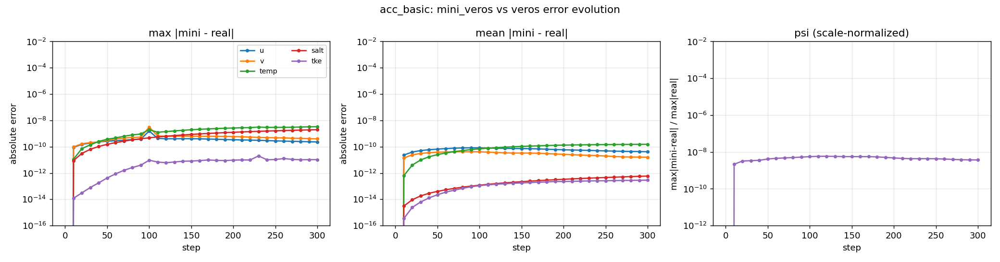

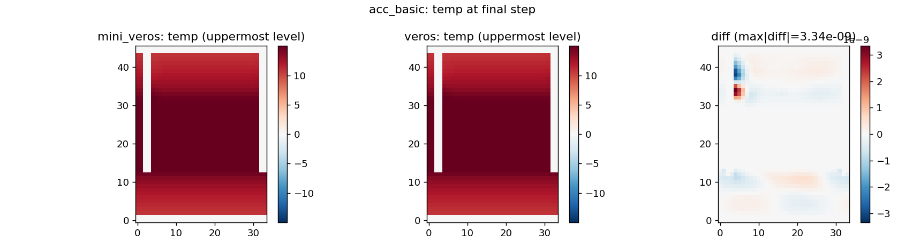
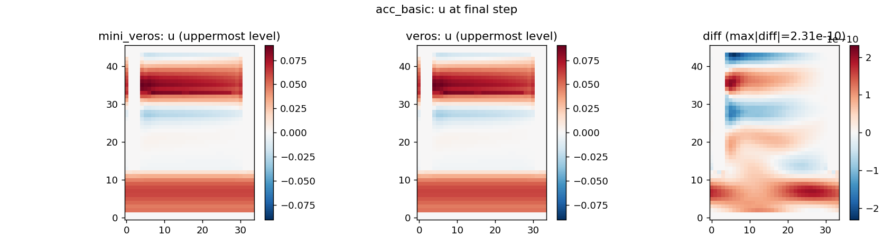
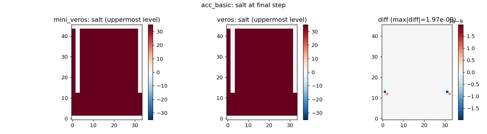

## acc

| field | max abs err (final step) | mean abs err (final step) |
|---|---|---|
| u | 2.34e-10 | 4.19e-11 |
| v | 4.03e-10 | 1.60e-11 |
| temp | 3.08e-09 | 1.56e-10 |
| salt | 2.09e-09 | 6.51e-13 |
| tke | 1.29e-11 | 2.40e-13 |
| eke | 7.98e-11 | 2.54e-12 |
| psi (scale-norm.) | 3.70e-09 | - |

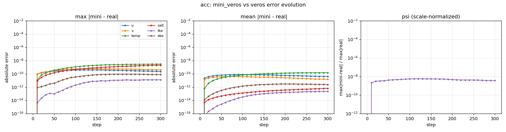
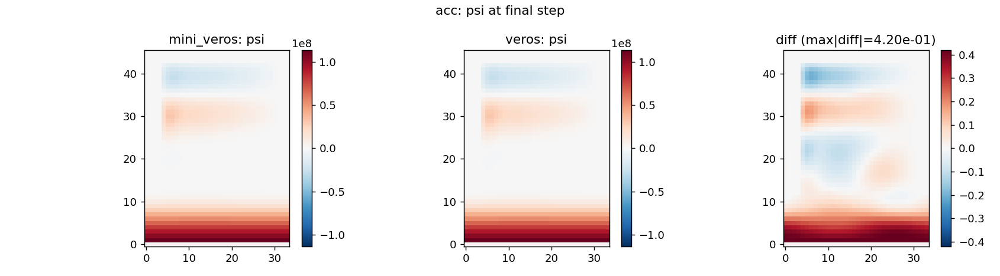
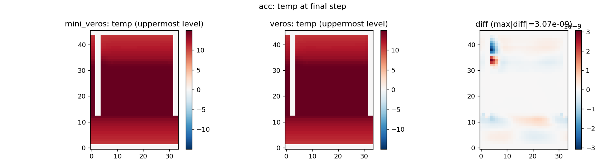
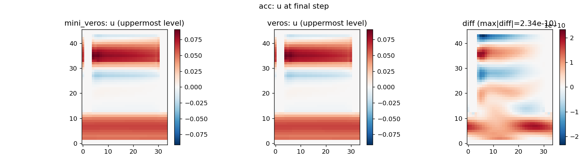

## global_4deg

| field | max abs err (final step) | mean abs err (final step) |
|---|---|---|
| u | 8.04e-10 | 9.86e-12 |
| v | 7.44e-10 | 9.27e-12 |
| temp | 7.13e-08 | 4.35e-10 |
| salt | 1.73e-08 | 4.55e-11 |
| tke | 1.46e-08 | 1.65e-12 |
| eke | 2.87e-10 | 1.38e-12 |
| psi (scale-norm.) | 2.19e-09 | - |

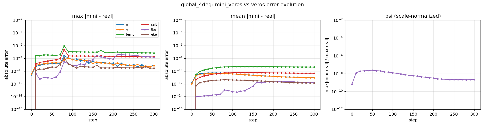
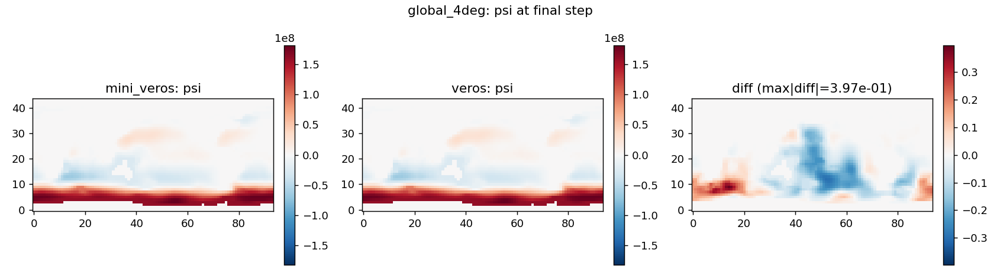
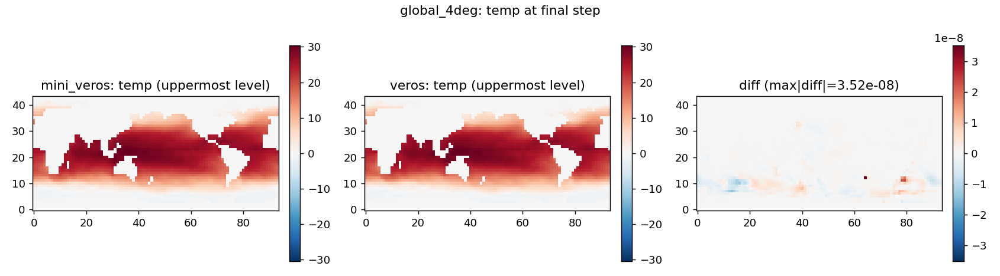
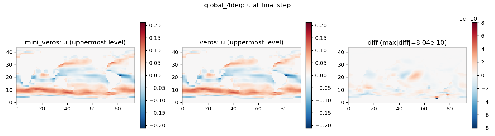
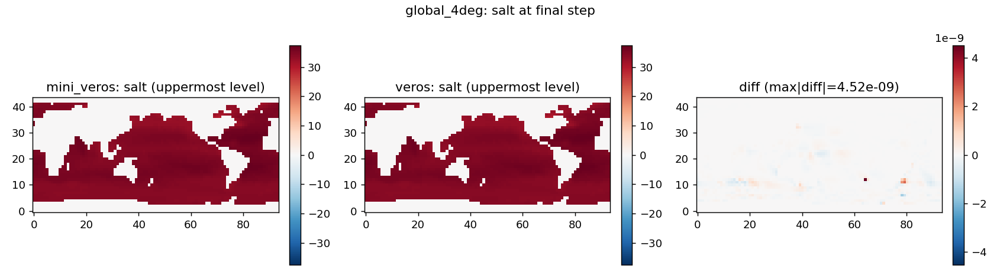
